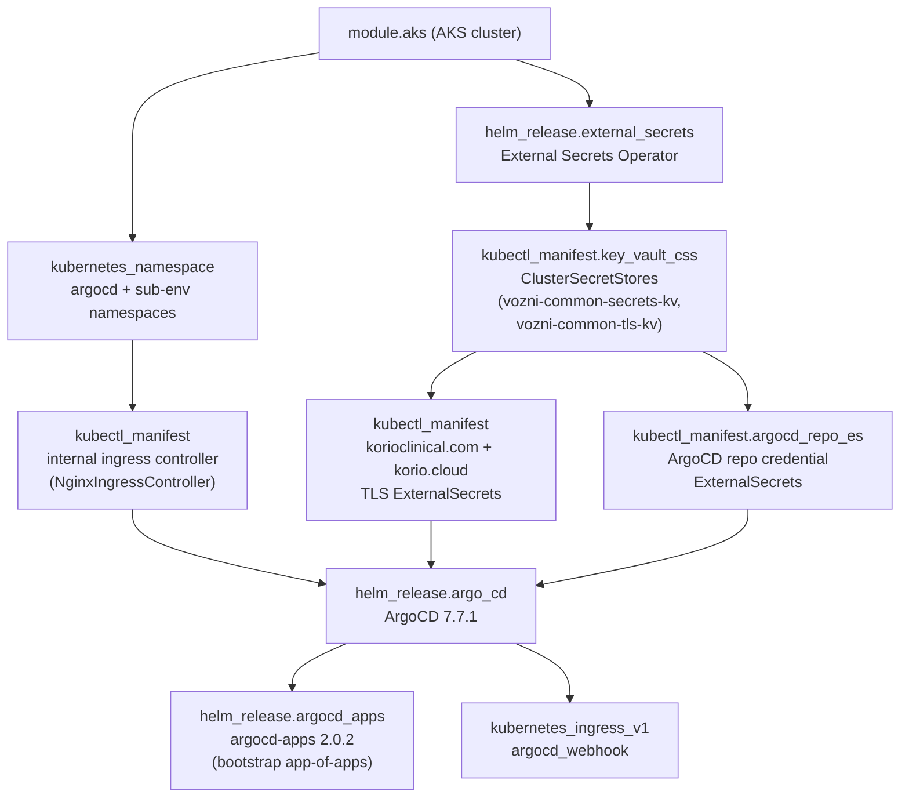

# Infrastructure

## Stack Overview

The platform deploys a clinical trial management system as
microservices implemented using a MERN stack on Azure Kubernetes
Service (AKS) via ArgoCD GitOps, with infrastructure managed by
Terraform in Terraform Cloud. The Azure infrastructure is in the US
East region.

Application data is stored in MongoDB Atlas databases.

Other tools used are Atlassian Jira and Confluence, and Microsoft Teams.

Observability is handled by Datadog (primary APM and log aggregation),
Azure Monitor (managed Prometheus metrics, Container Insights, Log
Analytics), Grafana (dashboards), and PagerDuty (on-call alerting).
Microsoft Teams receives alert notifications from MongoDB Atlas.

## External Dependencies (Not in IaC)

Several platform components are essential to how the system works but are
not represented in any of the repos here. When investigating routing,
auth, or connectivity issues, look here first.

**Source control and CI** — All code repos are hosted on GitHub
(`korio-clinical` org). CI/CD pipelines run on GitHub Actions; the
reusable workflow library lives in
`korio-clinical/github-reusable-workflows`.

**Kubernetes ingress** — AKS clusters are deployed with the
[Web Application Routing add-on](https://learn.microsoft.com/en-us/azure/aks/web-app-routing)
(`webapprouter`), which automatically provisions and manages an
nginx-based ingress controller and associated DNS/certificate resources.
These resources exist in the cluster and in Azure DNS but are **not**
tracked by Terraform or any manifest in these repos. Changes to ingress
behaviour (e.g. annotations, TLS certs) must be made via the AKS add-on
configuration, not via our IaC.

**WAF and DNS** — All inbound web traffic passes through **Cloudflare**
before reaching Azure. Cloudflare acts as a WAF (Web Application
Firewall) and reverse proxy, and provides the authoritative DNS for the
`korioclinical.com` domain. The WAF uses a curated managed ruleset
provided by Cloudflare, so there are no custom WAF rules to maintain in
Terraform or elsewhere. DNS records are managed in Cloudflare directly.

**Customer authentication** — End-users log into the application via
**Azure Entra B2C** tenants. B2C acts as the Identity Provider (IdP);
the application delegates login, MFA, and token issuance to B2C rather
than handling credentials itself. B2C tenant configuration is managed
outside these repos. There is **one tenant per environment** (not per
client) — all clients within an environment share the same B2C tenant.
Tenant naming pattern: `korio{env}aad` (e.g. `korioproductionaad`).
See the [Azure B2C Integration](application-stack.md#azure-entra-b2c-integration)
section for full technical details.

**Application database** — Persistent application data is stored in
**MongoDB Atlas** clusters hosted on Azure and connected to AKS via
**Azure Private Link**. The Private Link endpoints appear in Terraform
(`terraform-infra`), but the Atlas clusters, users, and database-level
configuration are managed in MongoDB Atlas directly (Terraform Atlas
provider resources may exist — verify before making manual changes).

**Developer network access** — Private Azure resources (AKS API server,
internal load balancers, ArgoCD UIs, etc.) are not reachable from the
public internet. Developer access is mediated by **Twingate**, which
provides zero-trust network access to private subnets. A Twingate client
must be running and connected to access any `*.internal` or
cluster-internal endpoint.

## terraform-infra (Terraform/HCL)

Azure infrastructure across workspaces: `org/` (ACR, DNS, GitHub,
Sentinel, PagerDuty), `env/` (AKS, VNets, Key Vault), `app/` (K8s
deployments, SFTP), `*-monitor/` (alerts). Reusable modules in
`modules/`.

```bash
terraform fmt -recursive
terraform validate
terraform plan
tflint --init && tflint
```

Providers: azurerm, Cloudflare, GitHub, PagerDuty, MongoDB Atlas,
Helm, Kubernetes.

## Deployment Flow

```
Code Repo → GitHub Actions → Docker Build → ACR → ArgoCD → AKS
```

Manifest changes follow GitOps: commit → ArgoCD auto-sync → Kubernetes apply.

## ArgoCD Cluster Bootstrap

When a new AKS cluster is provisioned, ArgoCD and its supporting tooling are
deployed entirely by Terraform (`terraform-infra/env/`) in a fixed dependency
order. No manual `helm install` or `argocd` CLI steps are required.

### Deployment sequence



**Step 1 — Namespaces** (`kubernetes_namespace.namespace`)

All namespaces are created before any workloads, labeled
`app.kubernetes.io/managed-by: terraform`. The set includes `argocd`
plus every sub-environment namespace for the environment. ArgoCD appsets
use `CreateNamespace=false`, so namespaces must pre-exist.

**Step 2 — Internal ingress controller** (`kubectl_manifest.internal_ingress_controller`)

Creates an AKS Web Application Routing `NginxIngressController` resource
that provisions an internal (private) load balancer on the `aks-ingress-snet`
subnet. ArgoCD's server ingress uses the internal ingress class
(`internal.webapprouting.kubernetes.azure.com`). A 120-second
`time_sleep` follows to allow the controller to fully start before
dependent resources try to create Ingress objects.

**Step 3 — External Secrets Operator** (`helm_release.external_secrets`)

Deploys ESO (chart `external-secrets` 0.10.5) to the `external-secrets`
namespace with Workload Identity enabled, allowing it to authenticate
to Azure Key Vault without a stored credential.

**Step 4 — ClusterSecretStores** (`kubectl_manifest.key_vault_css`)

Creates two `ClusterSecretStore` resources that point to organisation-wide
Key Vaults using `WorkloadIdentity` auth:

| Secret store | Key Vault | Contents |
|---|---|---|
| `vozni-common-secrets-kv` | Organisation-wide secrets KV | GitHub App credentials for ArgoCD repo sync |
| `vozni-common-tls-kv` | Organisation-wide TLS KV | Wildcard TLS certificates |

**Step 5 — TLS certificate ExternalSecrets**

`ExternalSecret` resources are created in every namespace. They pull
`{environment}-korioclinical-com-pfx` and `{environment}-korio-cloud-pfx`
from `vozni-common-tls-kv` and create `korio-tls` and `internal-korio-tls`
Kubernetes secrets. ArgoCD's ingress TLS uses `korio-tls`.

**Step 6 — ArgoCD repository credential ExternalSecrets**
(`kubectl_manifest.argocd_repo_es`)

Creates one `ExternalSecret` per tracked repository, all in the `argocd`
namespace and labeled `argocd.argoproj.io/secret-type: repository` so
ArgoCD picks them up automatically. Credentials come from the
`argocd-repo-sync-github-app` secret in `vozni-common-secrets-kv`,
which holds a GitHub App's app ID, installation ID, and private key.

Repositories bootstrapped this way:
- `korio-clinical/argocd` — ApplicationSet/Application definitions
- `korio-clinical/kubernetes-manifests` — shared Helm chart
- `korio-clinical/korio-helm` — supporting Helm resources

**Step 7 — ArgoCD installation** (`helm_release.argo_cd`)

Installs ArgoCD chart `7.7.1` from `https://argoproj.github.io/argo-helm`.
Key values set at install time:

| Setting | Value |
|---|---|
| Domain | `argocd-{env}.korioclinical.com` |
| Server ingress | `internal.webapprouting.kubernetes.azure.com`, TLS via `korio-tls` |
| `server.insecure` | `true` (TLS terminated at ingress, not at ArgoCD server) |
| Admin account | Disabled |
| Exec (terminal) | Enabled |
| GitHub webhook secret | From `var.argocd_github_webhook_secret` |

**SSO (Dex)**

Two identity connectors are configured:

| Connector | Type | Source |
|---|---|---|
| GitHub | `github` | `korio-clinical` org; teams listed per-environment in `locals.tf` |
| Microsoft Entra | `microsoft` | Azure AD application created in `azure_applications.tf`; groups: `devops-team`, `Engineering`, `ClientServices` |

The Azure AD application (`azuread_application.argocd_sso`) and its
client secret are created by the same Terraform workspace and injected
directly into the Helm release.

**RBAC**

Default policy is deny-all. Named policies grant:

| Subject | Role | Scope |
|---|---|---|
| `devops-team` Entra group | `role:admin` | All |
| `korio-clinical:devops` GitHub team | `role:admin` | All |
| `{env}-argocd-users` Entra group | `role:user` | `apps/*` and `addons/*` |
| `korio-clinical:deploy-{env}` GitHub team | `role:user` | `apps/*` and `addons/*` |
| Dev/QA GitHub teams (per-env config) | `role:user` | `apps/*` and `addons/*` |

`role:user` can view all projects, sync and restart application pods,
and use the exec terminal. `role:admin` has full access.

**Step 8 — Bootstrap applications** (`helm_release.argocd_apps`)

Installs the `argocd-apps` chart `2.0.2`. This chart creates the two
ArgoCD projects (`apps`, `addons`) and two bootstrap Application objects
that complete the GitOps handoff from Terraform:

| Application | Source path in `argocd` repo | Project | Manages |
|---|---|---|---|
| `apps` | `apps/{env}/` | `apps` | All microservice ApplicationSets |
| `addons` | `addons/{env}/` | `addons` | Cluster add-ons (RabbitMQ, mock-SFTP, etc.) |

Both applications run with `automated: {prune: true, selfHeal: true,
allowEmpty: true}`. From this point forward, changes to the `argocd`
repo automatically propagate to the cluster without any further Terraform
involvement. See the `argocd` section in [Application Stack](application-stack.md#argocd-yaml)
for the app-of-apps structure and ApplicationSet pattern.

**Step 9 — Webhook ingress** (`kubernetes_ingress_v1.argocd_webhook`)

Creates a public (external) ingress rule on `aks-{env}.korioclinical.com`
that maps `/argocd/api/webhook` to `argocd-server:80`. This allows
GitHub to push webhook events that trigger immediate ArgoCD syncs on
`argocd` repo pushes, rather than waiting for the default polling interval.

### Prerequisites before running `terraform apply`

The following must exist before the Terraform workspace can complete
successfully:

| Prerequisite | Where to set it |
|---|---|
| `argocd_github_app_id` and `argocd_github_app_secret` | GitHub OAuth app registered in `korio-clinical` org; pass as Terraform variables |
| `argocd_github_webhook_secret` | Arbitrary shared secret; set in GitHub repo webhook settings and as Terraform variable |
| `argocd-repo-sync-github-app` Key Vault secret | GitHub App (app ID, installation ID, private key) stored in `vozni-common-secrets-kv` |
| `{env}-korioclinical-com-pfx` and `{env}-korio-cloud-pfx` | Wildcard TLS certs in `vozni-common-tls-kv` |
| Azure AD application for ArgoCD SSO | Created by `azure_applications.tf` in the same workspace — no manual action needed |

### UI endpoints

ArgoCD is accessible at `https://argocd-{env}.korioclinical.com` (VPN
required; uses internal ingress). Login via GitHub SSO (requires
`korio-clinical` org membership in the appropriate team) or Microsoft
Entra SSO.

| Environment | URL |
|---|---|
| dev | `https://argocd-dev.korioclinical.com` |
| test | `https://argocd-test.korioclinical.com` |
| platform | `https://argocd-platform.korioclinical.com` |
| staging | `https://argocd-staging.korioclinical.com` |
| prod | `https://argocd-prod.korioclinical.com` |
| platform3 / staging3 / prod3 | `https://argocd-{env}.korioclinical.com` |

## Sub-environment Configuration

### Two independent sub-environment lists exist and can drift

There are two separate canonical lists of active sub-environments per
environment, managed by different systems:

1. **Terraform** (`terraform-infra/env/locals.tf` and
   `terraform-infra/app/locals.tf`): Controls what Azure infrastructure
   gets provisioned. Both files define identical `sub_environments` maps.
   For prod, the Terraform list is `["configure", "accept", "my",
   "validate", "preview"]`.

2. **presto-besto-manifesto** (`{env}/subenvironments.yaml`): Controls
   which sub-environments the presto pipeline includes when generating
   ArgoCD ApplicationSet YAMLs via korioctl. For prod, this currently
   lists `configure`, `validate`, `accept`, `my`. `preview` has
   Terraform infrastructure provisioned but is not yet active in the
   deployment pipeline.

   **prod-validate activation status (as of 2026-02-26):** Fully
   activated. All service ApplicationSets regenerated via argocd PR #869
   (merged 2026-02-26). See `docs/runbooks/enable-prod-validate.md` for
   the full runbook. All DLDP entries for `prodsftpmirror` created
   (2026-02-26): biostats, cluepoints, icsf, maestro, pci, fisher.

The current state of both lists, derived from `terraform-infra/env/locals.tf`
and each `{env}/subenvironments.yaml`:

| Environment | configure | preview | validate | accept | my | Notes |
|---|:---:|:---:|:---:|:---:|:---:|---|
| sandbox    | active  | -       | -       | -       | -      | TF provisions configure only |
| dev        | active  | tf only | active  | tf only | tf only | |
| test       | active  | tf only | active  | tf only | active  | |
| platform   | active  | active  | active  | tf only | tf only | |
| staging    | active  | active  | active  | tf only | tf only | |
| prod       | active  | tf only | active  | active  | active  | preview: infra exists, not yet in presto |
| platform3  | tf only | tf only | tf only | tf only | tf only | no presto env dir; v3/ReCode infra only |
| staging3   | tf only | tf only | tf only | tf only | tf only | no presto env dir; v3/ReCode infra only |
| prod3      | tf only | tf only | tf only | tf only | tf only | no presto env dir; v3/ReCode infra only |

**Key:** `active` = deployed in both Terraform and presto pipeline;
`tf only` = Azure infrastructure provisioned, not yet in presto pipeline;
`-` = not provisioned in Terraform.

### What Terraform provisions per sub-environment

Iterating over `sub_environments[environment]`, Terraform automatically
provisions:
- One **Azure Key Vault** per sub-env (`env/azure_key_vault.tf`) —
  e.g. `vozni-prod-validate`
- One **SFTP public IP** per sub-env (`app/sftp_ips.tf`)
- One **SFTP managed disk** per sub-env (`app/sftp_disk_storage.tf`)

### Activating a new sub-environment (checklist)

> For a detailed worked example with actual commands and values, see
> `docs/runbooks/enable-prod-validate.md`. To verify whether a sub-env is
> already correctly configured, see `docs/runbooks/validate-subenv-config.md`.

To bring a sub-env from "infrastructure exists" to "fully deployed",
the following are required across multiple repos:

1. **Azure**: Provision workload identities for `int-biostats-node`,
   `int-nest-node`, and `int-nest-node-v1.0.0` for the new sub-env.
   These are Azure Managed Identities with federated credentials bound
   to K8s service accounts. They are **not** managed by any Terraform
   in this repo — their UUIDs must be obtained from wherever they are
   created.

2. **Azure**: Create Data Lake Directory Paths (DLDP) in
   `{env}sftpmirror/mirror/{env}/{subenv}/...` for every SFTP
   integration configured in the Kustomize overlay (Phase 5 below).
   Use `korioctl azure dldp create` with the sftp-server and service
   UAMIs' **Principal IDs** (not Client IDs — they differ). If skipped,
   `sftp-data-sync` will fail silently when mirroring files. See the
   runbook for the full ACL parameters.

3. **Kubernetes**: Confirm the namespace exists in the cluster. ArgoCD
   appsets use `CreateNamespace=false`, so the namespace must pre-exist.
   Namespace creation is not handled by Terraform or any manifest in
   these repos.

4. **presto-besto-manifesto**:
   - Add the sub-env to `{env}/subenvironments.yaml` (triggers appset
     regeneration for all services via the presto pipeline)
   - Create `{env}/presto_conf/.internal/{subenv}/identities.yaml`
     with the workload identity UUIDs from step 1

5. **argocd** (`apps/{env}/{subenv}/`): Ensure all envfrom ConfigMap
   files are present. When cloning from an adjacent sub-env, compare
   file counts — missing files will cause appset sync failures.

6. **argocd** (`apps/{env}/sftp-server.yaml`): Add the sub-env to the
   generator list **manually** — this file is not generated by korioctl.
   Do not merge until the `kubernetes-manifests` overlay (step 7) is
   already on `main`, or ArgoCD will immediately enter a ComparisonError.

7. **kubernetes-manifests**: Create the SFTP Kustomize overlay at
   `kustomize/sftp-server/overlays/{env}/{subenv}/` by copying an
   existing sub-env overlay and substituting `KORIO_SUBENVIRONMENT`,
   `loadbalancerIp`, `persistentVolume`, and sftp-server UAMI client ID
   values for the new sub-env. Merge this **before** the argocd PR.
