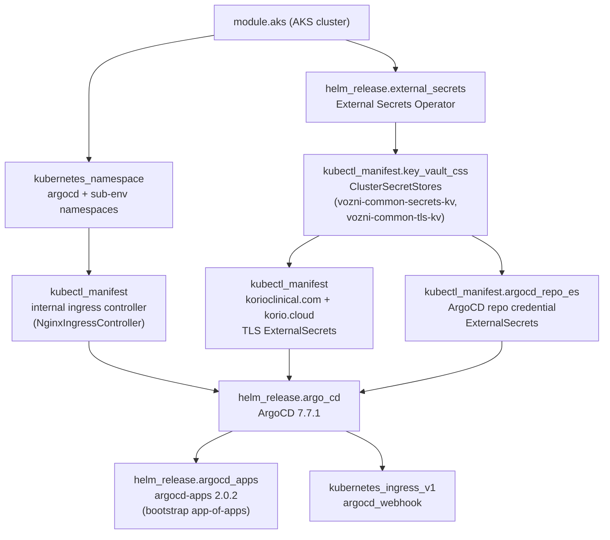

# Infrastructure

## Stack Overview

The platform deploys a clinical trial management system as
microservices implemented using a MERN stack on Azure Kubernetes
Service (AKS) via ArgoCD GitOps, with infrastructure managed by
Terraform in Terraform Cloud. The Azure infrastructure is in the US
East region.

Application data is stored in MongoDB Atlas databases.

Other tools used are Atlassian Jira and Confluence, and Microsoft Teams.

Observability is handled by Datadog (primary APM and log aggregation),
Azure Monitor (managed Prometheus metrics, Container Insights, Log
Analytics), Grafana (dashboards), and PagerDuty (on-call alerting).
Microsoft Teams receives alert notifications from MongoDB Atlas.

## External Dependencies (Not in IaC)

Several platform components are essential to how the system works but are
not represented in any of the repos here. When investigating routing,
auth, or connectivity issues, look here first.

**Source control and CI** — All code repos are hosted on GitHub
(`korio-clinical` org). CI/CD pipelines run on GitHub Actions; the
reusable workflow library lives in
`korio-clinical/github-reusable-workflows`.

**Kubernetes ingress** — AKS clusters are deployed with the
[Web Application Routing add-on](https://learn.microsoft.com/en-us/azure/aks/web-app-routing)
(`webapprouter`), which automatically provisions and manages an
nginx-based ingress controller and associated DNS/certificate resources.
These resources exist in the cluster and in Azure DNS but are **not**
tracked by Terraform or any manifest in these repos. Changes to ingress
behaviour (e.g. annotations, TLS certs) must be made via the AKS add-on
configuration, not via our IaC.

**WAF and DNS** — All inbound web traffic passes through **Cloudflare**
before reaching Azure. Cloudflare acts as a WAF (Web Application
Firewall) and reverse proxy, and provides the authoritative DNS for the
`korioclinical.com` domain. The WAF uses a curated managed ruleset
provided by Cloudflare, so there are no custom WAF rules to maintain in
Terraform or elsewhere. DNS records are managed in Cloudflare directly.

**Customer authentication** — End-users log into the application via
**Azure Entra B2C** tenants. B2C acts as the Identity Provider (IdP);
the application delegates login, MFA, and token issuance to B2C rather
than handling credentials itself. B2C tenant configuration is managed
outside these repos. There is **one tenant per environment** (not per
client) — all clients within an environment share the same B2C tenant.
Tenant naming pattern: `korio{env}aad` (e.g. `korioproductionaad`).
See the [Azure B2C Integration](application-stack.md#azure-entra-b2c-integration)
section for full technical details.

**Application database** — Persistent application data is stored in
**MongoDB Atlas** clusters hosted on Azure and connected to AKS via
**Azure Private Link**. Atlas clusters, database users, and Private Link
endpoints are managed by Terraform (`terraform-infra/env/atlas_clusters.tf`,
`env/atlas_privatelink_azure.tf`, `env/azure_privatelink_atlas.tf`). There
are three distinct Atlas identity tiers: (1) **application users** — one per
sub-environment, Terraform-managed, credential injected into every pod via
ExternalSecret; (2) **human/developer users** — provisioned by
`devops-scripts/atlas/provision-db-user/provision-db-user.sh`, secrets stored
in the central `korio-credentials` Key Vault; (3) a **master admin** user per
cluster, Terraform-managed, password in Terraform state only. The MongoDB
connection URI for each sub-environment must be written to that sub-env's
Key Vault manually after each Terraform apply — Terraform does not do this
automatically. See [MongoDB Atlas Credential Management](#mongodb-atlas-credential-management).
Do not create or modify Atlas database users whose name matches a sub-environment
name outside of Terraform — they will be overwritten on the next apply.

**Developer network access** — Private Azure resources (AKS API server,
internal load balancers, ArgoCD UIs, etc.) are not reachable from the
public internet. Developer access is mediated by **Twingate**, which
provides zero-trust network access to private subnets. A Twingate client
must be running and connected to access any `*.internal` or
cluster-internal endpoint.

## korio.cloud DNS Architecture

The `korio.cloud` domain is used exclusively for internal
service-to-service communications within each AKS cluster. It is
entirely separate from `korioclinical.com`, which carries user-facing
traffic via Cloudflare.

### DNS resolution chain

DNS resolution inside AKS follows this path:

```
Pod
  --> CoreDNS (in-cluster; handles cluster.local, then forwards)
  --> Azure VNet DNS (168.63.129.16; built-in resolver for the AKS VNet)
  --> Azure Private DNS zones (*.{env}.korio.cloud)
```

CoreDNS does not define stub zones for `korio.cloud` — it simply forwards
non-cluster queries to the Azure VNet DNS resolver, which intercepts them
and serves answers from the VNet-linked private DNS zones.

### Private DNS zones

One private DNS zone per environment (`{env}.korio.cloud`) is provisioned
in the `devops-test` resource group and linked to the AKS VNet for that
environment. These zones serve three purposes:

1. **Node auto-registration** — the VNet link has `registrationEnabled:
   true`, so AKS nodes register their private IP addresses automatically
   when they join the cluster.
2. **Wildcard internal routing** — a `*` A record (TTL 1) points to the
   internal NGINX load balancer IP, routing all
   `*.{env}.korio.cloud` hostnames to the in-cluster ingress controller.
3. **Twingate access** — the Twingate connector container uses the VNet
   DHCP-assigned DNS server (168.63.129.16), which resolves these private
   zone records. This is what allows developers to reach
   internal hostnames over the Twingate tunnel.

### Public DNS zones

Azure also contains **public** DNS zones for `{env}.korio.cloud` (one per
environment, held in per-environment resource groups). These zones are not
delegated from Cloudflare and are therefore unreachable from the public
internet. They are orphaned artefacts — they predate the migration of
`korio.cloud` to Cloudflare — and serve no active purpose.

### Compliance gap

Neither the private nor the public `korio.cloud` DNS zones are managed by
Terraform. They were provisioned manually and sit in non-standard resource
groups. This is a compliance gap: infrastructure that is not represented
in IaC cannot be reviewed, audited, or safely modified via the standard
change process.

The remediation plan is:
1. Import private DNS zones into `terraform-infra/env/` (no infrastructure
   changes — state-only operation).
2. Delete the orphaned public DNS zones via Terraform.
3. Relocate private zones from `devops-test` to `vozni-{env}-rg`
   (deferred: requires Twingate impact assessment).

See the [korio.cloud DNS Remediation runbook](runbooks/korio-cloud-dns-remediation.md)
for the step-by-step procedure.

## terraform-infra (Terraform/HCL)

Azure infrastructure across workspaces: `org/` (ACR, DNS, GitHub,
Sentinel, PagerDuty), `env/` (AKS, VNets, Key Vault), `app/` (K8s
deployments, SFTP), `*-monitor/` (alerts). Reusable modules in
`modules/`.

```bash
terraform fmt -recursive
terraform validate
terraform plan
tflint --init && tflint
```

Providers: azurerm, Cloudflare, GitHub, PagerDuty, MongoDB Atlas,
Helm, Kubernetes.

## Deployment Flow

```
Code Repo → GitHub Actions → Docker Build → ACR → ArgoCD → AKS
```

Manifest changes follow GitOps: commit → ArgoCD auto-sync → Kubernetes apply.

## ArgoCD Cluster Bootstrap

When a new AKS cluster is provisioned, ArgoCD and its supporting tooling are
deployed entirely by Terraform (`terraform-infra/env/`) in a fixed dependency
order. No manual `helm install` or `argocd` CLI steps are required.

### Deployment sequence


```mermaid
flowchart TD
    AKS["module.aks (AKS cluster)"]
    NS["kubernetes_namespace\nargocd + sub-env namespaces"]
    IC["kubectl_manifest\ninternal ingress controller\n(NginxIngressController)"]
    ESO["helm_release.external_secrets\nExternal Secrets Operator"]
    CSS["kubectl_manifest.key_vault_css\nClusterSecretStores\n(vozni-common-secrets-kv,\nvozni-common-tls-kv)"]
    TLS["kubectl_manifest\nkorioclinical.com + korio.cloud\nTLS ExternalSecrets"]
    REPO["kubectl_manifest.argocd_repo_es\nArgoCD repo credential\nExternalSecrets"]
    ACD["helm_release.argo_cd\nArgoCD 7.7.1"]
    APPS["helm_release.argocd_apps\nargocd-apps 2.0.2\n(bootstrap app-of-apps)"]
    WH["kubernetes_ingress_v1\nargocd_webhook"]

    AKS --> NS
    AKS --> ESO
    NS --> IC
    IC --> ACD
    ESO --> CSS
    CSS --> TLS
    CSS --> REPO
    TLS --> ACD
    REPO --> ACD
    ACD --> APPS
    ACD --> WH
```

**Step 1 — Namespaces** (`kubernetes_namespace.namespace`)

All namespaces are created before any workloads, labeled
`app.kubernetes.io/managed-by: terraform`. The set includes `argocd`
plus every sub-environment namespace for the environment. ArgoCD appsets
use `CreateNamespace=false`, so namespaces must pre-exist.

**Step 2 — Internal ingress controller** (`kubectl_manifest.internal_ingress_controller`)

Creates an AKS Web Application Routing `NginxIngressController` resource
that provisions an internal (private) load balancer on the `aks-ingress-snet`
subnet. ArgoCD's server ingress uses the internal ingress class
(`internal.webapprouting.kubernetes.azure.com`). A 120-second
`time_sleep` follows to allow the controller to fully start before
dependent resources try to create Ingress objects.

**Step 3 — External Secrets Operator** (`helm_release.external_secrets`)

Deploys ESO (chart `external-secrets` 0.10.5) to the `external-secrets`
namespace with Workload Identity enabled, allowing it to authenticate
to Azure Key Vault without a stored credential.

**Step 4 — ClusterSecretStores** (`kubectl_manifest.key_vault_css`)

Creates two `ClusterSecretStore` resources that point to organisation-wide
Key Vaults using `WorkloadIdentity` auth:

| Secret store | Key Vault | Contents |
|---|---|---|
| `vozni-common-secrets-kv` | Organisation-wide secrets KV | GitHub App credentials for ArgoCD repo sync |
| `vozni-common-tls-kv` | Organisation-wide TLS KV | Wildcard TLS certificates |

**Step 5 — TLS certificate ExternalSecrets**

`ExternalSecret` resources are created in every namespace. They pull
`{environment}-korioclinical-com-pfx` and `{environment}-korio-cloud-pfx`
from `vozni-common-tls-kv` and create `korio-tls` and `internal-korio-tls`
Kubernetes secrets. ArgoCD's ingress TLS uses `korio-tls`.

**Step 6 — ArgoCD repository credential ExternalSecrets**
(`kubectl_manifest.argocd_repo_es`)

Creates one `ExternalSecret` per tracked repository, all in the `argocd`
namespace and labeled `argocd.argoproj.io/secret-type: repository` so
ArgoCD picks them up automatically. Credentials come from the
`argocd-repo-sync-github-app` secret in `vozni-common-secrets-kv`,
which holds a GitHub App's app ID, installation ID, and private key.

Repositories bootstrapped this way:
- `korio-clinical/argocd` — ApplicationSet/Application definitions
- `korio-clinical/kubernetes-manifests` — shared Helm chart
- `korio-clinical/korio-helm` — supporting Helm resources

**Step 7 — ArgoCD installation** (`helm_release.argo_cd`)

Installs ArgoCD chart `7.7.1` from `https://argoproj.github.io/argo-helm`.
Key values set at install time:

| Setting | Value |
|---|---|
| Domain | `argocd-{env}.korioclinical.com` |
| Server ingress | `internal.webapprouting.kubernetes.azure.com`, TLS via `korio-tls` |
| `server.insecure` | `true` (TLS terminated at ingress, not at ArgoCD server) |
| Admin account | Disabled |
| Exec (terminal) | Enabled |
| GitHub webhook secret | From `var.argocd_github_webhook_secret` |

**SSO (Dex)**

Two identity connectors are configured:

| Connector | Type | Source |
|---|---|---|
| GitHub | `github` | `korio-clinical` org; teams listed per-environment in `locals.tf` |
| Microsoft Entra | `microsoft` | Azure AD application created in `azure_applications.tf`; groups: `devops-team`, `Engineering`, `ClientServices` |

The Azure AD application (`azuread_application.argocd_sso`) and its
client secret are created by the same Terraform workspace and injected
directly into the Helm release.

**RBAC**

Default policy is deny-all. Named policies grant:

| Subject | Role | Scope |
|---|---|---|
| `devops-team` Entra group | `role:admin` | All |
| `korio-clinical:devops` GitHub team | `role:admin` | All |
| `{env}-argocd-users` Entra group | `role:user` | `apps/*` and `addons/*` |
| `korio-clinical:deploy-{env}` GitHub team | `role:user` | `apps/*` and `addons/*` |
| Dev/QA GitHub teams (per-env config) | `role:user` | `apps/*` and `addons/*` |

`role:user` can view all projects, sync and restart application pods,
and use the exec terminal. `role:admin` has full access.

**Step 8 — Bootstrap applications** (`helm_release.argocd_apps`)

Installs the `argocd-apps` chart `2.0.2`. This chart creates the two
ArgoCD projects (`apps`, `addons`) and two bootstrap Application objects
that complete the GitOps handoff from Terraform:

| Application | Source path in `argocd` repo | Project | Manages |
|---|---|---|---|
| `apps` | `apps/{env}/` | `apps` | All microservice ApplicationSets |
| `addons` | `addons/{env}/` | `addons` | Cluster add-ons (RabbitMQ, mock-SFTP, etc.) |

Both applications run with `automated: {prune: true, selfHeal: true,
allowEmpty: true}`. From this point forward, changes to the `argocd`
repo automatically propagate to the cluster without any further Terraform
involvement. See the `argocd` section in [Application Stack](application-stack.md#argocd-yaml)
for the app-of-apps structure and ApplicationSet pattern.

**Step 9 — Webhook ingress** (`kubernetes_ingress_v1.argocd_webhook`)

Creates a public (external) ingress rule on `aks-{env}.korioclinical.com`
that maps `/argocd/api/webhook` to `argocd-server:80`. This allows
GitHub to push webhook events that trigger immediate ArgoCD syncs on
`argocd` repo pushes, rather than waiting for the default polling interval.

### Prerequisites before running `terraform apply`

The following must exist before the Terraform workspace can complete
successfully:

| Prerequisite | Where to set it |
|---|---|
| `argocd_github_app_id` and `argocd_github_app_secret` | GitHub OAuth app registered in `korio-clinical` org; pass as Terraform variables |
| `argocd_github_webhook_secret` | Arbitrary shared secret; set in GitHub repo webhook settings and as Terraform variable |
| `argocd-repo-sync-github-app` Key Vault secret | GitHub App (app ID, installation ID, private key) stored in `vozni-common-secrets-kv` |
| `{env}-korioclinical-com-pfx` and `{env}-korio-cloud-pfx` | Wildcard TLS certs in `vozni-common-tls-kv` |
| Azure AD application for ArgoCD SSO | Created by `azure_applications.tf` in the same workspace — no manual action needed |

### UI endpoints

ArgoCD is accessible at `https://argocd-{env}.korioclinical.com` (VPN
required; uses internal ingress). Login via GitHub SSO (requires
`korio-clinical` org membership in the appropriate team) or Microsoft
Entra SSO.

| Environment | URL |
|---|---|
| dev | `https://argocd-dev.korioclinical.com` |
| test | `https://argocd-test.korioclinical.com` |
| platform | `https://argocd-platform.korioclinical.com` |
| staging | `https://argocd-staging.korioclinical.com` |
| prod | `https://argocd-prod.korioclinical.com` |
| platform3 / staging3 / prod3 | `https://argocd-{env}.korioclinical.com` |

## Sub-environment Configuration

### Two independent sub-environment lists exist and can drift

There are two separate canonical lists of active sub-environments per
environment, managed by different systems:

1. **Terraform** (`terraform-infra/env/locals.tf` and
   `terraform-infra/app/locals.tf`): Controls what Azure infrastructure
   gets provisioned. Both files define identical `sub_environments` maps.
   For prod, the Terraform list is `["configure", "accept", "my",
   "validate", "preview"]`.

2. **presto-besto-manifesto** (`{env}/subenvironments.yaml`): Controls
   which sub-environments the presto pipeline includes when generating
   ArgoCD ApplicationSet YAMLs via korioctl. For prod, this currently
   lists `configure`, `validate`, `accept`, `my`. `preview` has
   Terraform infrastructure provisioned but is not yet active in the
   deployment pipeline.

   **prod-validate activation status (as of 2026-02-26):** Fully
   activated. All service ApplicationSets regenerated via argocd PR #869
   (merged 2026-02-26). See `docs/runbooks/enable-prod-validate.md` for
   the full runbook. All DLDP entries for `prodsftpmirror` created
   (2026-02-26): biostats, cluepoints, icsf, maestro, pci, fisher.

The current state of both lists, derived from `terraform-infra/env/locals.tf`
and each `{env}/subenvironments.yaml`:

| Environment | configure | preview | validate | accept | my | Notes |
|---|:---:|:---:|:---:|:---:|:---:|---|
| sandbox    | active  | -       | -       | -       | -      | TF provisions configure only |
| dev        | active  | tf only | active  | tf only | tf only | |
| test       | active  | tf only | active  | tf only | active  | |
| platform   | active  | active  | active  | tf only | tf only | |
| staging    | active  | active  | active  | tf only | tf only | |
| prod       | active  | tf only | active  | active  | active  | preview: infra exists, not yet in presto |
| platform3  | tf only | tf only | tf only | tf only | tf only | no presto env dir; v3/ReCode infra only |
| staging3   | tf only | tf only | tf only | tf only | tf only | no presto env dir; v3/ReCode infra only |
| prod3      | tf only | tf only | tf only | tf only | tf only | no presto env dir; v3/ReCode infra only |

**Key:** `active` = deployed in both Terraform and presto pipeline;
`tf only` = Azure infrastructure provisioned, not yet in presto pipeline;
`-` = not provisioned in Terraform.

### What Terraform provisions per sub-environment

Iterating over `sub_environments[environment]`, Terraform automatically
provisions:
- One **Azure Key Vault** per sub-env (`env/azure_key_vault.tf`) —
  e.g. `vozni-prod-validate`
- One **SFTP public IP** per sub-env (`app/sftp_ips.tf`)
- One **SFTP managed disk** per sub-env (`app/sftp_disk_storage.tf`)
- One **Atlas database user** per sub-env (`env/atlas_clusters.tf`) —
  username = sub-env name; password lives in Terraform state only and is
  **not** written to Key Vault automatically (see
  [MongoDB Atlas Credential Management](#mongodb-atlas-credential-management))
- One **Atlas cluster** per sub-env for `prod`/`staging`/`prod3`/`staging3`
  (`env/atlas_clusters.tf`) — e.g. `vozni-prod-validate`; `dev`, `test`,
  `platform`, and `sandbox` use a single shared cluster (`vozni-{env}`)

### Activating a new sub-environment (checklist)

> For a detailed worked example with actual commands and values, see
> `docs/runbooks/enable-prod-validate.md`. To verify whether a sub-env is
> already correctly configured, see `docs/runbooks/validate-subenv-config.md`.

To bring a sub-env from "infrastructure exists" to "fully deployed",
the following are required across multiple repos:

1. **Azure**: Provision workload identities for `int-biostats-node`,
   `int-nest-node`, and `int-nest-node-v1.0.0` for the new sub-env.
   These are Azure Managed Identities with federated credentials bound
   to K8s service accounts. They are **not** managed by any Terraform
   in this repo — their UUIDs must be obtained from wherever they are
   created.

2. **Azure**: Create Data Lake Directory Paths (DLDP) in
   `{env}sftpmirror/mirror/{env}/{subenv}/...` for every SFTP
   integration configured in the Kustomize overlay (Phase 5 below).
   Use `korioctl azure dldp create` with the sftp-server and service
   UAMIs' **Principal IDs** (not Client IDs — they differ). If skipped,
   `sftp-data-sync` will fail silently when mirroring files. See the
   runbook for the full ACL parameters.

3. **Kubernetes**: Confirm the namespace exists in the cluster. ArgoCD
   appsets use `CreateNamespace=false`, so the namespace must pre-exist.
   Namespace creation is not handled by Terraform or any manifest in
   these repos.

4. **presto-besto-manifesto**:
   - Add the sub-env to `{env}/subenvironments.yaml` (triggers appset
     regeneration for all services via the presto pipeline)
   - Create `{env}/presto_conf/.internal/{subenv}/identities.yaml`
     with the workload identity UUIDs from step 1

5. **argocd** (`apps/{env}/{subenv}/`): Ensure all envfrom ConfigMap
   files are present. When cloning from an adjacent sub-env, compare
   file counts — missing files will cause appset sync failures.

6. **argocd** (`apps/{env}/sftp-server.yaml`): Add the sub-env to the
   generator list **manually** — this file is not generated by korioctl.
   Do not merge until the `kubernetes-manifests` overlay (step 7) is
   already on `main`, or ArgoCD will immediately enter a ComparisonError.

7. **kubernetes-manifests**: Create the SFTP Kustomize overlay at
   `kustomize/sftp-server/overlays/{env}/{subenv}/` by copying an
   existing sub-env overlay and substituting `KORIO_SUBENVIRONMENT`,
   `loadbalancerIp`, `persistentVolume`, and sftp-server UAMI client ID
   values for the new sub-env. Merge this **before** the argocd PR.

8. **MongoDB Key Vault secret**: After `terraform apply` creates the Atlas
   database user for the new sub-env, write the full MongoDB connection URI
   (with the Terraform-managed password) to the sub-env's Key Vault. This
   step is not automated. See
   [MongoDB Atlas Credential Management](#mongodb-atlas-credential-management).

---

## MongoDB Atlas Credential Management

### Access identity taxonomy

There are three distinct Atlas identity tiers, each with different ownership
and lifecycle:

| Tier | Who/what | Count | Managed by | Credentials stored |
|---|---|---|---|---|
| **Application (sub-env)** | One per sub-environment; used by every microservice in that sub-env | 5/cluster | Terraform | Terraform state; URI in sub-env Key Vault |
| **Master admin** | Single `admin` user with `atlasAdmin` on each cluster | 1/cluster | Terraform | Terraform state only |
| **Human/developer** | Named users for developer direct access (MongoDBCompass, Atlas UI) | Variable | Manual (`provision-db-user.sh`) | Per-user secret in central `korio-credentials` Key Vault |

The application tier is the operationally significant one: it backs the
`MONGO_CONNECTION_STRING` env var that every running microservice reads.
The human tier is independent — human credentials are stored in a
**separate central Key Vault** (`korio-credentials`), not in the per-sub-env
vaults used by applications.

### Resource ownership

Atlas infrastructure is split across Terraform-managed and manually-managed
resources:

| Resource | Owner | Source file |
|---|---|---|
| Atlas project | Terraform | `env/atlas_clusters.tf` |
| Atlas clusters | Terraform | `env/atlas_clusters.tf` |
| Private Link (Atlas side) | Terraform | `env/atlas_privatelink_azure.tf` |
| Private Link (Azure side) | Terraform | `env/azure_privatelink_atlas.tf` |
| App database users (one per sub-env) | Terraform | `env/atlas_clusters.tf` |
| Master admin user | Terraform | `env/atlas_clusters.tf` |
| MongoDB URI in sub-env Key Vault | **Manual** | Not written by Terraform |
| Human/developer Atlas users | Manual | `devops-scripts/atlas/provision-db-user/` |
| Human user secrets in central Key Vault | Manual | `devops-scripts/atlas/provision-db-user/` |
| Key Vault RBAC for human secrets | Manual | `devops-scripts/atlas/provision-db-user/` |

### Database user naming convention

Terraform creates one Atlas database user per sub-environment via
`mongodbatlas_database_user.app_users`, iterating over
`local.sub_environments[local.environment]`:

- **Username**: the sub-environment name — e.g. `validate`, `configure`, `accept`
- **Auth database**: `admin`
- **Password**: generated by `random_password.mongoatlas_users[subenv]`;
  stored in Terraform state only — not written anywhere outside Terraform
- **Roles** (granted on each of the following databases):
  - `{subenv}` — e.g. `validate`
  - `{env}-{subenv}` — e.g. `prod-validate`
  - `{env}-{subenv}-{db}` for every database in `atlas_extra_databases["common"]`:
    `global`, `acme`, `biopab`, `pharmaco`, `recode`, `moderna`, `maia`,
    `alpheus`, `kumquat`, `tagworks`, `tgtherapeutics`
  - Additionally for specific environments: `dev`/`test` add `jjdemo`, `bms`,
    `korio`; `platform` adds `korio`

Atlas cluster names follow this convention (from `env/atlas_clusters.tf`):

| Environments | Cluster name pattern | Example |
|---|---|---|
| `prod`, `staging`, `prod3`, `staging3` | `vozni-{env}-{subenv}` | `vozni-prod-validate` |
| `dev`, `test`, `platform`, `sandbox` | `vozni-{env}` (shared) | `vozni-dev` |

The Private Link hostname embedded in connection URIs follows the pattern:
`vozni-{env}-{subenv}-pl-0.{cluster-id}.mongodb.net` (per-subenv clusters) or
`vozni-{env}-pl-0.{cluster-id}.mongodb.net` (shared clusters). Confirm the
`{cluster-id}` suffix from the Atlas UI or from an existing working envfrom
ConfigMap (e.g. `argocd/apps/{env}/{subenv}/`) — for prod-validate it is
`v1wct`: `vozni-prod-validate-pl-0.v1wct.mongodb.net`.

### The Key Vault gap

Terraform manages the Atlas database user and its password, but **does not
write the MongoDB connection URI to Key Vault**. The full URI — including the
Terraform-generated password — must be stored manually in the sub-environment's
Key Vault (`vozni-{env}-{subenv}`). The application reads it from there via
ExternalSecret.

```
TF state ──manages──> Atlas user  (username={subenv}, password=<TF random>)
                                             |
                                   no automated link
                                             |
Key Vault secret <── set manually ─  MongoDB URI  (must contain same password)
       |
ExternalSecret syncs to K8s Secret (refreshInterval: 30s)
       |
auth-node / application pods
```

**Risk:** Any `terraform apply` that touches `mongodbatlas_database_user.app_users`
or `random_password.mongoatlas_users` reconciles the Atlas password back to the
value in TF state. If Key Vault was set with a different password (e.g. after a
manual change in Atlas), the mismatch causes immediate authentication failures
in every pod that connects to MongoDB. Terraform prints no warning about this.

### Rules for working with Atlas database users

1. **Never manually create or modify an Atlas user whose username matches a
   sub-environment name** (`configure`, `validate`, `accept`, `my`, `preview`).
   Terraform owns these. Manual changes are overwritten on the next `terraform apply`.

2. **After any `terraform apply` that modifies Atlas users, update Key Vault.**
   The apply will not warn that Key Vault is now out of sync — this is a
   silent failure mode.

3. **Temporary debug users are safe** as long as the username does not match a
   sub-environment name. Delete them from Atlas when done.

### Human/developer user provisioning

Human users (developers accessing Atlas directly via MongoDB Compass or the
Atlas UI) are provisioned by the script at
`devops-scripts/atlas/provision-db-user/provision-db-user.sh`. It performs
the full workflow in one pass:

1. Creates a database user in the Atlas project for the target environment
2. Resolves all cluster Private Link hostnames in that project
3. Constructs a `mongodb+srv://` connection URI per cluster
4. Writes each URI as a Key Vault secret to the central `korio-credentials`
   vault (subscription `a26c9760-e77e-4149-97b4-6c33453b3dbd`, RG
   `vozni-common-rg`), using the naming convention:
   `{username}-{cluster-name}-db-connection-string`
5. Sets an Azure RBAC role assignment so only the named user's Entra identity
   can read their own secrets

Roles granted vary by environment:
- Lower environments (`dev`, `test`, `platform`): `readWriteAnyDatabase`
- `prod`/`prod3`: custom read-only roles (`prod-admin-readonly-my`,
  `prod3-admin-readonly-my`)

The resulting secret count per human user scales with the number of clusters
they require access to — up to 24 secrets for full cross-environment access.

Existing provisioned users are tracked in
`devops-scripts/atlas/populate-provisioned-users-catalog/`, which scans the
`korio-credentials` vault and generates Terraform HCL catalog entries and
Azure RBAC import blocks. The script explicitly excludes the sub-environment
service account names (`configure`, `preview`, `validate`, `accept`, `my`,
`admin`) from its output.

### Application credential injection flow

Application pods receive their MongoDB connection string via the following
chain:

```
Terraform apply
  --> creates/rotates random_password for sub-env Atlas user
  --> stores password in Terraform state only
         |
    [manual step]
         |
         v
Sub-env Key Vault  (vozni-{env}-{subenv})
  secret name: MONGO-CONNECTION-STRING
         |
ExternalSecret  (refreshInterval: 30s)
  --> syncs to K8s Secret  {appName}-kv  in namespace {subenv}
         |
Pod env var: MONGO_CONNECTION_STRING
  --> all microservices in the sub-env share this single credential
```

Key points:
- **All microservices in a sub-environment share one Atlas credential.** There
  is no per-service or per-pod identity at the application tier.
- The credential is static between Terraform applies. Rotation is manual and
  requires both a Terraform apply and a Key Vault update (see below).
- Additional MongoDB-related env vars (`MONGO_NAME_PREFIX`, `MONGO_HOST`,
  `MONGO_MAX_POOL_SIZE`) are sourced from ConfigMaps, not Key Vault.

### Updating Key Vault after a Terraform apply

Read the Terraform-managed password from HCP Terraform state:

```bash
cd terraform-infra/
terraform workspace select vozni-{env}

terraform state show 'random_password.mongoatlas_users["{subenv}"]' | grep result
```

Construct the full URI and write it to Key Vault (confirm the `{cluster-id}`
suffix before running — the secret name and URI format must match what is
referenced by the ExternalSecret in the `argocd/apps/{env}/{subenv}/` envfrom
ConfigMaps):

```bash
az keyvault secret set \
  --vault-name vozni-{env}-{subenv} \
  --name <mongo-uri-secret-name> \
  --value "mongodb+srv://{subenv}:<password>@vozni-{env}-{subenv}-pl-0.<cluster-id>.mongodb.net/?authSource=admin"
```

Force ESO to re-sync immediately rather than waiting up to 30 seconds:

```bash
kubectl annotate externalsecret <es-name> -n {subenv} \
  --context vozni-{env}-aks \
  force-sync="$(date +%s)" --overwrite
```

For diagnosing MongoDB auth vs. connectivity failures and recovering from a
deleted or mismatched Atlas user, see
`runbooks/atlas-credential-reconciliation.md`.
