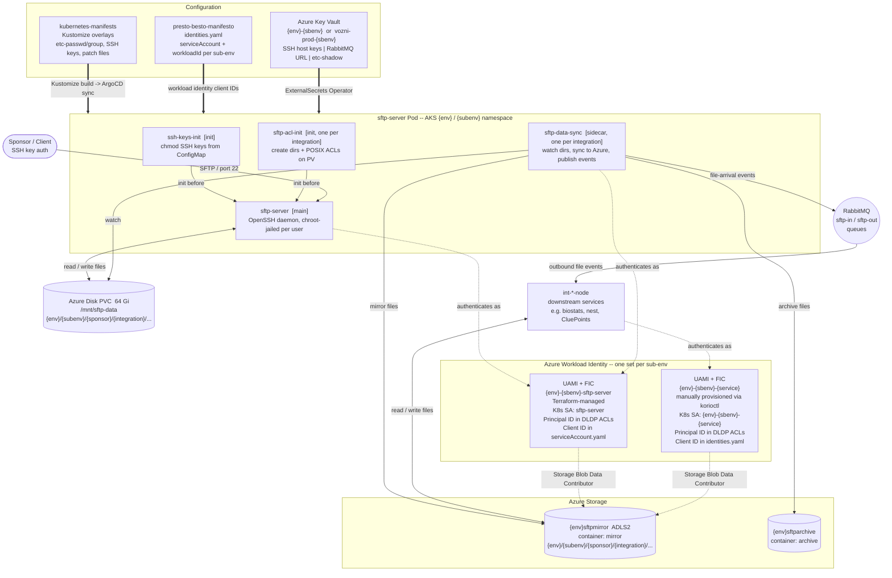

# SFTP

The three SFTP repos (`sftp-server-docker`, `sftp-acl-init-go`, and the
Kustomize manifests in `kubernetes-manifests`) form one cohesive
deployment unit. Understanding how they connect is essential before
modifying any of them.

## Architecture Overview

The diagram below shows the full runtime topology, the Azure identity
chain, and the configuration sources that drive it.

Solid arrows = data flow. Dashed arrows = authentication / RBAC grants.
Double arrows = configuration pushed at deploy time.



## Key Repos and Commands

### sftp-server-docker (Docker)

Hardened OpenSSH/SFTP server container image (Debian Bullseye) pushed
to ACR. Provides chroot-jailed, secure file transfer for sponsors and
integrations across all environments. Key security features: Protocol 2
only, no root login, per-user authorized keys in
`/etc/ssh/authorized_keys.d/%u`, chroot jail via `ChrootDirectory %h`.

```bash
az acr login --name korio
docker buildx build \
  -t korio.azurecr.io/sftp-server:<version> \
  --platform=linux/amd64 --push .
```

### sftp-acl-init-go (Go)

Kubernetes init container that creates the SFTP directory tree and
applies POSIX ACLs before the SFTP server pod starts. Replaces opaque
Azure blob snapshots for filesystem seeding. Runs in read-only mode by
default (validates existing dirs/ACLs); pass `-modify` to create dirs
and apply ACLs. ACL operations are Linux-specific — unit tests must run
on Linux.

```bash
mage build          # Build binary via Dagger
mage test           # Run unit tests via Dagger
go test ./...       # Run Go tests directly (Linux only)
```

CLI usage:

```bash
/usr/bin/sftp-acl-init \
  -sponsor=<sponsor> \
  -integration=<integration> \
  -modify                # Omit for read-only validation mode
```

Required env vars: `KORIO_ENVIRONMENT`, `KORIO_SUBENVIRONMENT`,
`SFTP_DRIVE_ROOT_MOUNTPOINT` (default `/mnt/sftp-data`).

## Deployment Architecture

### Why Azure Storage and why UAMI/FIC/DLDP?

Sponsors connect via SFTP and drop files into agreed folder paths. SFTP
alone is a transient file drop — Korio also needs files to be durably
stored, accessible to backend services, and mirrored into Azure Data Lake
Storage Gen2 (ADLS2) so Azure-native tooling can consume them and files
are backed by Azure storage redundancy rather than an AKS-local disk.

ADLS2 is Azure Blob Storage with a hierarchical namespace that enables
POSIX-style ACLs per directory. The relevant storage account is
`{env}sftpmirror` (e.g. `prodsftpmirror`), container `mirror`. Every
integration gets a path like `{env}/{subenv}/{sponsor}/{integration}/...`.

For pods to authenticate to Azure Storage without embedded secrets, Korio
uses **Azure Workload Identity**, which involves three components:

- **UAMI (User Assigned Managed Identity)** — A named Azure identity
  representing a pod. Azure RBAC roles are granted to the UAMI; no
  passwords or keys are stored in the cluster.
- **FIC (Federated Identity Credential)** — The trust binding between
  Kubernetes and Azure AD. A FIC says: "trust tokens issued by *this*
  cluster (`issuer`) for *this* ServiceAccount (`subject`) as if they
  were this UAMI." Azure AD exchanges the pod's ServiceAccount token for
  an Azure access token.
- **DLDP (Data Lake Directory Path)** — The Data Lake directory tree must
  pre-exist with POSIX ACLs granting the right UAMIs the right
  permissions. `korioctl azure dldp create` creates a directory and sets
  its ACLs in one step. If skipped, `sftp-data-sync` fails silently — the
  directory doesn't exist and the service has no permission to create it.
  ACLs use the UAMI's **Principal ID** (not Client ID — these are
  different UUIDs for the same identity). The command takes two ACL
  sets: `-p` (ParentACL — the default/inherited ACL for new child paths)
  and `-l` (LeafACL — the ACL on the directory being created). Both must
  be specified; the code does not derive defaults automatically. Four
  principals appear in every leaf ACL: the `sftp-server` UAMI and the
  client service UAMI (both get `rwx`), plus the per-environment Entra AD
  security groups `sftp-read-{env}` (read-only humans, `r-x`) and
  `sftp-read-write-{env}` (read-write humans, `rwx`).

### Runtime data flow

```
Sponsor uploads file via SFTP
        │
        ▼
sftp-server pod  (authenticates to Key Vault as {env}-{subenv}-sftp-server UAMI)
        │  writes file to Azure Disk (PV)
        │
sftp-data-sync sidecar  (authenticates to {env}sftpmirror as sftp-server UAMI)
        │  copies file to {env}sftpmirror/mirror/{env}/{subenv}/{sponsor}/{integration}/...
        │  publishes file event to RabbitMQ
        ▼
int-biostats-node / int-nest-node  (authenticates to {env}sftpmirror as its own UAMI)
        │  reads and processes file
        ▼
output written to Data Lake or MongoDB
```

Each Kubernetes-to-Azure boundary requires a UAMI + FIC pair per
sub-environment. `sftp-server` and each client service (e.g.
`int-biostats-node`) each have their own UAMI. The sftp-server UAMI is
Terraform-managed; client service UAMIs must be provisioned manually (see
`runbooks/enable-prod-validate.md` for the procedure).

### Kustomize Structure

```
kubernetes-manifests/kustomize/sftp-server/
├── base/                          # Shared pod template, PVC, Service,
│   ├── deployment.yaml            #   ExternalSecrets — NOT modified
│   ├── externalsecrets.yaml       #   directly for new integrations
│   ├── pv.yaml / pvc.yaml
│   └── service.yaml
└── overlays/
    └── {env}/                     # dev, test, platform, staging, prod …
        └── {subenv}/              # configure, preview, validate, accept, my
            ├── kustomization.yaml
            ├── patches/           # JSON Merge Patches per integration
            │   ├── int-{name}.yaml          # ACL init + data-sync sidecar
            │   ├── humanHomedirs.yaml        # Home dir subPath mounts
            │   ├── loadbalancerIp.yaml
            │   ├── persistentVolume.yaml
            │   └── serviceAccount.yaml      # Workload identity client ID for pod
            └── generators/        # Files baked into ConfigMaps/Secrets
                ├── etc-passwd     # Unix user DB (defines UIDs)
                ├── etc-group      # Unix group DB (defines GIDs)
                ├── etc-gshadow    # Group shadow (Secret, not ConfigMap)
                └── ssh-public-keys/{username}
```

### Pod Container Chain

Four container types run in a single pod; init containers run to
completion in order before the main containers start:

| # | Container | Type | Image | Purpose |
|---|-----------|------|-------|---------|
| 1 | `ssh-keys-init` | init (base) | `korio.azurecr.io/alpine` | Copies SSH public keys from ConfigMap to emptyDir with correct Unix permissions (dirs 555, files 444) |
| 2 | `sftp-acl-init-{sponsor}-{integration}` | init (**patched**) | `korio.azurecr.io/sftp-acl-init` | Creates SFTP directory tree and applies POSIX ACLs on the data volume |
| 3 | `sftp-server` | main (base) | `korio.azurecr.io/sftp-server` | Runs the OpenSSH/SFTP daemon |
| 4 | `sftp-data-sync-{integration}` | sidecar (**patched**) | `korio.azurecr.io/sftp-data-sync` | Watches directories, publishes file events to RabbitMQ, syncs to Azure Storage |

### How sftp-acl-init Is Wired In

`sftp-acl-init` containers are **not in the base** — they are injected
per integration via JSON Merge Patches in each overlay:

```yaml
# overlays/prod/accept/patches/int-maestro.yaml (abridged)
- op: add
  path: /spec/template/spec/initContainers/-
  value:
    name: sftp-acl-init-moderna-maestro
    image: korio.azurecr.io/sftp-acl-init:latest
    args:
      - -acl=u::rwx,u:moderna-maestro:rwx,g:korio-rw:rwx,m::rwx,o::---
      - -modify
      - -integration=maestro
      - -sponsor=moderna
      - -subdirs=4157-P101_MaestroQcImport,4157-P101_MaestroQcImportResponse,...
    env:
      - name: KORIO_ENVIRONMENT
        value: prod           # hardcoded to match overlay path
      - name: KORIO_SUBENVIRONMENT
        value: accept
    volumeMounts:
      - name: sftp-data          # RW — creates dirs, sets ACLs
        mountPath: /mnt/sftp-data
      - name: etc-passwd-etc-group
        mountPath: /etc/passwd   # RO — UID/GID lookup for ACL validation
        subPath: etc-passwd
      - name: etc-passwd-etc-group
        mountPath: /etc/group
        subPath: etc-group
      - ...                      # etc-shadow, etc-gshadow also mounted RO
```

The same patch file typically also adds the `sftp-data-sync` sidecar for
that integration. `KORIO_ENVIRONMENT` and `KORIO_SUBENVIRONMENT` are
hardcoded to match the overlay directory path. `SFTP_DRIVE_ROOT_MOUNTPOINT`
is not passed explicitly — the volume is always mounted at `/mnt/sftp-data`.

### Volume Sharing

| Volume | Type | `sftp-acl-init` | `sftp-server` |
|--------|------|-----------------|---------------|
| `sftp-data` (64Gi PVC) | Azure Premium Disk | RW — sets dirs + ACLs | RW — stores files |
| `etc-passwd-etc-group` | ConfigMap (per overlay) | RO — UID/GID lookup | RO — login auth |
| `etc-shadow` / `etc-gshadow` | Secret (per overlay) | RO | RO |
| `ssh-public-keys-chmod` | emptyDir (from `ssh-keys-init`) | not mounted | RO — authorized_keys |

Storage isolation is via **subPaths**: each user's home (`/home/moderna-maestro`)
maps to `sftp-data` at `{env}/{subenv}/{sponsor}/{integration}`, so all
users and integrations share one PV without collision.

### User/Group DB Flow

The UIDs and GIDs referenced in `-acl` arguments **must match** what is
committed in `generators/etc-passwd` and `generators/etc-group` for that
overlay. Kustomize's `configMapGenerator` bundles these files into a
ConfigMap at build time; both `sftp-acl-init` and `sftp-server` mount
the same ConfigMap. When adding a new user or integration:

1. Add the user to `generators/etc-passwd` and `generators/etc-group`
   (and `generators/etc-gshadow` if needed) in every affected overlay.
2. Add their SSH public key file under `generators/ssh-public-keys/`.
3. Add the `sftp-acl-init` init container (and `sftp-data-sync` sidecar
   if required) via a new patch file, and reference it in
   `kustomization.yaml`.
4. Add a home directory subPath mount via `humanHomedirs.yaml`.

### Secrets (External Secrets Operator)

Two ExternalSecrets pull from Azure Key Vault into the pod's namespace:

- **`sftp-ssh-host-keys`** — Ed25519 and RSA server identity keys
  (`sftp-server-ed25519-key`, `sftp-server-rsa-key`)
- **`rabbitmq-url`** — RabbitMQ connection string used by `sftp-data-sync`
  sidecars (`RABBITMQ-URL` → `rabbitmq_url`)

## CI Workflows (GitHub Actions)

Both `sftp-server-docker` and `sftp-acl-init-go` share the same
Terraform-managed CI pattern using reusable workflows from
`korio-clinical/github-reusable-workflows`:

- **PR** (`.github/workflows/pr.yaml`) — Runs checks on PRs to `main`
  or `release/*`.
- **dev-deploy** — Auto-deploys to `dev` on push to `main`.
- **test/platform/staging/prod and \*3 variants** — Manual
  (`workflow_dispatch`) or tag-triggered deployments. Staging/staging3
  target `X.Y.Z-rcN` tags; prod/prod3 target `X.Y.Z` release tags.

All deploy workflows use concurrency control (`cancel-in-progress: true`
for PRs) and inherit GitHub secrets.

## Adding a New Integration

This section covers everything needed to wire up a new sponsor/integration
from scratch. The same steps apply to every `{env}/{subenv}` the
integration will be active in — the values are the same across overlays;
only `KORIO_ENVIRONMENT` and `KORIO_SUBENVIRONMENT` differ.

### Data to collect before starting

Gather the following before touching any files. Missing any item will
block you partway through.

**From the sponsor/client team:**

| # | Item | Example | Notes |
|---|------|---------|-------|
| 1 | Sponsor slug | `tagworks` | Lowercase, no spaces, used in paths and usernames |
| 2 | Integration slug | `pci` | Same constraints |
| 3 | Study codes / protocol numbers | `mRNA-4157-P101` | One `sftp-acl-init` container per study |
| 4 | Subdirectory structure per study | `Inventory`, `Patient`, `Site` | These become the `-subdirs` argument |
| 5 | Direction of file flow | Sponsor uploads → Korio, or Korio writes → sponsor reads | Determines ACL mode; see below |
| 6 | SSH public key(s) for the service account | `ssh-ed25519 AAAA…` | One key per machine account |
| 7 | Human users (if any) | Name, email, SSH public key, ro or rw | Each human needs a separate Unix user entry |

**From the backend/platform team (or assign internally):**

| # | Item | Notes |
|---|------|-------|
| 8 | RabbitMQ inbound queue name | Convention: `int-{integration}-sftp-in` |
| 9 | RabbitMQ outbound queue name | Convention: `int-{integration}-sftp-out` |
| 10 | New UID(s) | Assign sequentially from the highest existing UID in `etc-passwd`; must be consistent across all overlays |
| 11 | New GID(s) | Same rule; see group naming convention below |

### ACL mode: upload vs download

The direction of file flow determines the ACL string used:

**Upload mode** — Sponsor writes files to Korio (e.g. Maestro, PCI). The
service account needs `rwx`; Korio staff get `rwx` (rw) or `r-x` (ro):

```
u::rwx,u:{sponsor}-{integration}:rwx,g::r-x,g:{sponsor}-{integration}:rwx,g:korio-rw:rwx,g:korio-ro:r-x,m::rwx,o::---
```

**Download mode** — Korio writes files; sponsor reads them (e.g. ICSF,
Biostats, CluePoints). Everyone gets `r-x` at the directory level; Korio
backend services write via their own UAMI, not via SFTP ACLs:

```
u::r-x,u:{sponsor}-{integration}:r-x,g::r-x,g:korio-rw:r-x,g:korio-ro:r-x,
g:{sponsor}-ro:r-x,g:{sponsor}-rw:r-x,
g:{integration}-ro:r-x,g:{integration}-rw:r-x,
g:{study}-ro:r-x,g:{study}-rw:r-x,
g:{sponsor}-{integration}-ro:r-x,g:{sponsor}-{integration}-rw:r-x,
g:{sponsor}-{study}-ro:r-x,g:{sponsor}-{study}-rw:r-x,
g:{integration}-{study}-ro:r-x,g:{integration}-{study}-rw:r-x,
g:{sponsor}-{integration}-{study}-ro:r-x,g:{sponsor}-{integration}-{study}-rw:r-x,
m::r-x,o::---
```

Many of these groups will be **empty at creation** — this is intentional.
Pre-creating the full combinatorial group set means future users can be
added by editing `etc-group` alone (no ACL string change, therefore no
need to re-examine or re-apply ACLs). Changing the ACL strings requires
a pod restart; changing group membership does not.

### Group naming convention (download mode)

For each new `{sponsor}` + `{integration}` + `{study}` combination,
create all of the following groups (both `-ro` and `-rw` variants):

```
{integration}-ro / {integration}-rw
{sponsor}-ro / {sponsor}-rw               # skip if sponsor already exists
{sponsor}-{integration}-ro / -rw
{study}-ro / {study}-rw                   # skip if study group already exists
{sponsor}-{study}-ro / -rw
{integration}-{study}-ro / -rw
{sponsor}-{integration}-{study}-ro / -rw
```

For upload mode integrations, you only need the service account's own
group (same name as the user, e.g. `moderna-maestro`) plus `korio-rw`
and `korio-ro`, which already exist.

### Files to modify

All edits are in `kubernetes-manifests/kustomize/sftp-server/overlays/{env}/{subenv}/`.

---

#### `generators/etc-passwd`

Add one line per new Unix user (service account + any human users):

```
{sponsor}-{integration}:x:{uid}:{gid}::/{home}/{sponsor}-{integration}:/usr/sbin/nologin
```

The GID in the passwd entry is the user's **primary group** (typically
the group that shares the service account's name). Human users typically
get `10000` (korio-ro) or `10001` (korio-rw) as their primary GID.

---

#### `generators/etc-group`

Add one line per new group. Include member usernames in the last field
for any group that has members at creation time; leave it blank for
pre-created empty groups:

```
{sponsor}-{integration}:x:{gid}:
{sponsor}-{integration}-ro:x:{gid}:
{sponsor}-{integration}-rw:x:{gid}:
...
```

For human users, add their usernames to the relevant `-ro` or `-rw`
group, e.g.:

```
moderna-icsf-ro:x:20016:bcastano,sabujoub
```

---

#### `generators/etc-gshadow`

Exactly mirrors `etc-group` — same groups, same members, but the
password field is `*` and the administrators field is empty:

```
{sponsor}-{integration}:*::
{sponsor}-{integration}-ro:*::someuser,anotheruser
```

---

#### `generators/ssh-public-keys/{username}`

Create one file per user containing their public key (single line):

```
ssh-ed25519 AAAA… user@example.com
```

---

#### `patches/int-{sponsor}-{integration}.yaml` (new file)

If there is only one study, or the integration uses upload mode, put
everything in one file. If there are multiple studies in download mode
(like ICSF), split into `int-{sponsor}-{integration}-acl.yaml` (one
`sftp-acl-init` block per study) and `int-{sponsor}-{integration}-datasync.yaml`
(home dir mount + sftp-data-sync).

The file contains three stanzas in order:

**1. sftp-acl-init init container** (one per study):

```yaml
- op: add
  path: /spec/template/spec/initContainers/-
  value:
    name: sftp-acl-init-{sponsor}-{integration}
    image: korio.azurecr.io/sftp-acl-init:latest
    imagePullPolicy: Always
    args:
      - -acl=<acl-string>       # see ACL mode section above
      - -modify
      - -integration={integration}
      - -sponsor={sponsor}
      - -subdirs={subdir1},{subdir2},...
    env:
      - name: KORIO_ENVIRONMENT
        value: {env}
      - name: KORIO_SUBENVIRONMENT
        value: {subenv}
    volumeMounts:
      - name: sftp-data
        readOnly: false
        mountPath: /mnt/sftp-data
      - name: etc-passwd-etc-group
        mountPath: /etc/passwd
        readOnly: true
        subPath: etc-passwd
      - name: etc-passwd-etc-group
        mountPath: /etc/group
        readOnly: true
        subPath: etc-group
      - name: etc-shadow
        readOnly: true
        mountPath: /etc/shadow
        subPath: etc-shadow
      - name: etc-gshadow
        readOnly: true
        mountPath: /etc/gshadow
        subPath: etc-gshadow
```

**2. Home directory volume mount** (sftp-server container, subPath to root of integration dir):

```yaml
- op: add
  path: /spec/template/spec/containers/0/volumeMounts/-
  value:
    name: sftp-data
    subPath: {env}/{subenv}/{sponsor}/{integration}
    readOnly: false
    mountPath: /home/{sponsor}-{integration}
```

**3. sftp-data-sync sidecar** (watches the integration root or specific subdirs):

```yaml
- op: add
  path: /spec/template/spec/containers/-
  value:
    name: sftp-data-sync-{sponsor}-{integration}
    image: korio.azurecr.io/sftp-data-sync:latest
    imagePullPolicy: Always
    args:
      - -dirpaths
      - /mnt/sftp-data/{env}/{subenv}/{sponsor}/{integration}
    env:
      - name: SFTP_RABBIT_BROKER_URL
        valueFrom:
          secretKeyRef:
            name: rabbitmq-url
            key: rabbitmq_url
      - name: KORIO_ENVIRONMENT
        value: {env}
      - name: KORIO_SUBENVIRONMENT
        value: {subenv}
      - name: SFTP_INBOUND_FILE_RABBIT_QUEUE
        value: int-{integration}-sftp-in
      - name: SFTP_OUTBOUND_FILE_RABBIT_QUEUE
        value: int-{integration}-sftp-out
      - name: SFTP_ARCHIVE_STORAGE_ACCOUNT
        value: {env}sftparchive
      - name: SFTP_ARCHIVE_STORAGE_CONTAINER
        value: archive
      - name: SFTP_MIRROR_STORAGE_ACCOUNT
        value: {env}sftpmirror
      - name: SFTP_MIRROR_STORAGE_CONTAINER
        value: mirror
    volumeMounts:
      - name: sftp-data
        readOnly: false
        mountPath: /mnt/sftp-data
```

Note: `sftp-data-sync` watches for file events and syncs to storage.
The `-dirpaths` argument takes a comma-separated list if you only want
to watch specific subdirs rather than the whole integration root (as
Maestro does for its `/Prod` subdirs).

---

#### `patches/humanHomedirs.yaml`

For each human user, add a volume mount stanza. Human users land in the
same directory their sponsor's service account does, or at `{env}/{subenv}`
for Korio staff:

```yaml
- op: add
  path: /spec/template/spec/containers/0/volumeMounts/-
  value:
    name: sftp-data
    subPath: {env}/{subenv}/{sponsor}/{integration}
    readOnly: false
    mountPath: /home/{username}
```

---

#### `kustomization.yaml`

Two additions:

**1.** Under `configMapGenerator.ssh-public-keys.files`, add one entry
per new user:

```yaml
- generators/ssh-public-keys/{sponsor}-{integration}
- generators/ssh-public-keys/{human-username}   # if applicable
```

**2.** Under `patches`, add the new patch file(s):

```yaml
- path: patches/int-{sponsor}-{integration}.yaml
  target:
    group: apps
    kind: Deployment
    version: v1
```

---

### Azure Identity Provisioning (UAMI/FIC/DLDP)

The Kubernetes manifest changes above wire up the container side. These
steps provision the Azure identity chain that allows the pod to
authenticate to storage. Perform them once per integration per
sub-environment, alongside the manifest changes.

**Prerequisites** — your account needs these IAM roles on the target
`{env}sftpmirror` storage account:

- Storage Blob Data Owner
- Security Admin

**Set up environment variables:**

```bash
export sub_id="<subscription-id>"
export kenv="<env>"                           # dev, test, staging, prod, etc.
export sftp_rg="vozni-${kenv}-sftp-storage"   # resource group for SFTP identities
export study="<service-name>"                 # e.g. int-icsf-node
```

#### Identity naming conventions

The UAMI, FIC, and Kubernetes ServiceAccount names follow different patterns
for the sftp-server and client services:

| | UAMI name | K8s ServiceAccount name | FIC subject |
|---|---|---|---|
| sftp-server (Terraform-managed) | `{env}-{subenv}-sftp-server` | `sftp-server` | `system:serviceaccount:{subenv}:sftp-server` |
| client service (manually provisioned) | `{env}-{subenv}-{service-name}` | `{env}-{subenv}-{service-name}` | `system:serviceaccount:{subenv}:{env}-{subenv}-{service-name}` |

For the sftp-server, the UAMI carries the full `{env}-{subenv}` prefix but the
Kubernetes ServiceAccount is simply `sftp-server` — the same bare name in every
namespace. For client services, the UAMI name and Kubernetes ServiceAccount name
are the same string.

The `{service-name}` component of client service identities has no established
convention. Two patterns have been observed in practice:

- `int-{integration}-node` — e.g. `int-biostats-node`, `int-nest-node`
- `{sponsor}-{integration}-{role}` — e.g. `moderna-icsf-consumer`, `tagworks-pci-consumer`

All UAMIs and FICs for both sftp-server and client services live in the
`vozni-{env}-sftp-storage` resource group.

#### Create UAMIs

Check which UAMIs already exist:

```bash
az identity list -g "${sftp_rg}" \
  --query "[?type == 'Microsoft.ManagedIdentity/userAssignedIdentities'].{Name:name, ClientID:clientId, PrincipalID:principalId}" \
  --output table | grep "${study}"
```

Create any that are missing (one per sub-environment):

```bash
cat "${kenv}/subenvironments.yaml"   # confirm active sub-environments
for sbenv in configure validate preview; do
  korioctl azure uami create -g "${sftp_rg}" "${kenv}-${sbenv}-${study}"
done
```

#### Create FICs

The AKS cluster acts as an OpenID Connect (OIDC) token issuer: it signs
each pod's Kubernetes ServiceAccount token with a cluster-specific key
pair, and publishes the corresponding public keys at a well-known URL
(`oidcIssuerProfile.issuerUrl`). When a pod exchanges its ServiceAccount
token for an Azure access token, Azure AD fetches the cluster's public
keys from that URL and verifies the token's signature. It then checks
the token against the UAMI's FIC — if the FIC's `issuer` matches the
signing URL and the FIC's `subject` matches the token's `sub` claim
(`system:serviceaccount:{namespace}:{serviceaccount-name}`), the exchange
succeeds. If no FIC exists, or either field is wrong, Azure AD rejects
the request with `AADSTS70025`.

Get the AKS OIDC issuer URL:

```bash
export oidc_url="$(basename $(az aks show \
  -g "vozni-${kenv}-rg" \
  --name "vozni-${kenv}-aks" \
  --query "oidcIssuerProfile.issuerUrl" \
  -otsv 2>/dev/null))"
```

Create one FIC per sub-environment:

```bash
for sbenv in configure validate preview; do
  korioctl azure fic create \
    -g "${sftp_rg}" \
    --identity "${kenv}-${sbenv}-${study}" \
    --issuer "https://eastus.oic.prodaks.azure.com/${sub_id}/${oidc_url}/" \
    --subject "system:serviceaccount:${sbenv}:${kenv}-${sbenv}-${study}" \
    "${kenv}-${sbenv}-${study}"
done
```

#### Create DLDPs

Gather the four Principal IDs needed for the leaf ACLs (note: these are
**Principal IDs**, not Client IDs — see the warning below):

```bash
# sftp-server UAMI principal ID (look up per sub-environment)
export sftp_srv_id="$(az identity list | \
  jq -r '.[] | "\(.name) \(.principalId)"' | \
  grep "^${kenv}-${sbenv}-" | sort | grep 'sftp-server' | awk '{print $2}')"

# client service UAMI principal ID
export client_srv_id="$(az identity list | \
  jq -r '.[] | "\(.name) \(.principalId)"' | \
  grep "^${kenv}-${sbenv}-" | sort | grep "${study}" | awk '{print $2}')"

# Entra AD read group (per environment)
export sftp_ro_id="$(az ad group show -g "sftp-read-${kenv}" | jq -r '.id')"

# Entra AD read-write group (per environment)
export sftp_rw_id="$(az ad group show -g "sftp-read-write-${kenv}" | jq -r '.id')"
```

> **Principal ID vs Client ID**: They are different UUIDs for the same
> identity. DLDPs always require the **Principal ID**. A common mistake
> is accidentally passing the Client ID — the ACL entry is accepted but
> never resolves to a named principal. In the Azure Portal Storage
> Browser under "Manage ACL", a valid Principal ID resolves to the
> principal's display name; a Client ID shows only the bare GUID.

Create the Data Lake directory path (run once per subdirectory that
`sftp-data-sync` watches):

```bash
korioctl azure dldp create \
  -a "${kenv}sftpmirror" \
  -f mirror \
  -p user::rwx -p group::r-x -p other::--x \
  -l user::r-x -l group::r-x -l other::--- \
  -l "user:${sftp_srv_id}:rwx" \
  -l "user:${client_srv_id}:rwx" \
  -l "group:${sftp_ro_id}:r-x" \
  -l "group:${sftp_rw_id}:rwx" \
  -l mask::rwx \
  "${kenv}/${sbenv}/${sponsor}/${integration}/${study-dir}/${subdir}"
```

The `-p` flags set the **ParentACL** (default ACL inherited by newly
created child paths). The `-l` flags set the **LeafACL** (ACL on the
directory being created, where `sftp-data-sync` reads and writes).
Both must always be specified explicitly.

#### Inspect Entra AD Group Membership

The `sftp-read-{env}` and `sftp-read-write-{env}` groups are baked into
every DLDP leaf ACL, so adding a human to one of these groups propagates
access to all SFTP mirror directories automatically.

List all members of both groups:

```bash
for group in "sftp-read-${kenv}" "sftp-read-write-${kenv}"; do
  echo "=== ${group} ==="
  az ad group member list \
    --group "${group}" \
    --query "[].{Name:displayName, UPN:userPrincipalName}" \
    --output table
done
```

Check whether a specific user is a member:

```bash
az ad group member check \
  --group "sftp-read-${kenv}" \
  --member-id "$(az ad user show --id user@domain.com --query id -otsv)"
```

Returns `{"value": true}` or `{"value": false}`.

Add a user to a group:

```bash
az ad group member add \
  --group "sftp-read-${kenv}" \
  --member-id "$(az ad user show --id user@domain.com --query id -otsv)"
```

Use `sftp-read-write-${kenv}` instead for read-write access.

Remove a user from a group:

```bash
az ad group member remove \
  --group "sftp-read-${kenv}" \
  --member-id "$(az ad user show --id user@domain.com --query id -otsv)"
```

Use `sftp-read-write-${kenv}` instead if the user is in the read-write group.

#### Access control model: grants only, no deny

ADLS2 POSIX ACLs are **purely additive** — there are no explicit deny
entries. This has two practical implications:

**Traversal vs. read access are separate.** To reach a file at
`prod/my/sponsor/integration/subdir/file.txt`, ADLS2 requires execute
(`x`) on every intermediate directory in the path. The ParentACL
(`-p other::--x`) gives execute-only (traversal, no listing) to all
authenticated principals on intermediate directories. Actual read or
write access is only possible at directories that have an explicit ACL
entry for the principal — so group members can traverse the hierarchy
but cannot list or read anything they have not been explicitly granted.

**Restricting access is by omission, not by denial.** Because there are
no deny entries, you cannot grant broad root access and then carve out
exceptions. The correct approach is to simply not include the group in
the leaf ACL for paths that should be restricted. For the `my`
sub-environment in particular — the final step in the client validation
lifecycle — exclude `sftp-read-{env}` and `sftp-read-write-{env}` from
the `-l` flags at DLDP creation time rather than attempting to remove
access afterwards.

If you do need to revoke group access from an existing DLDP path, set
the permission bits to `---` for that group entry:

```bash
az storage fs access update-recursive \
  --acl "group:<sftp_ro_id>:---" \
  --path "${kenv}/${sbenv}/${sponsor}/${integration}" \
  --file-system mirror \
  --account-name "${kenv}sftpmirror" \
  --auth-mode login
```

This is the closest ADLS2 offers to a deny: an explicit grant of no
permissions. It does not override other grants the principal may hold
via a different group membership or direct user entry.

#### Update Presto Identity Config

After UAMIs exist, register the **Client ID** (not Principal ID) in
`presto-besto-manifesto`:

```bash
# Get the Client ID for the service UAMI
az identity list | \
  jq -r '.[] | "\(.name) \(.clientId)"' | \
  grep "^${kenv}-${sbenv}-" | sort | grep "${study}"
```

In `presto-besto-manifesto/${kenv}/presto_conf/.internal/${sbenv}/identities.yaml`,
add an entry to the `identityConfig` dictionary:

```yaml
identityConfig:
  <service-name>:                              # e.g. int-icsf-node
    serviceAccount: ${kenv}-${sbenv}-${study}
    workloadId: <client-id>                    # Client ID, NOT Principal ID
```

Each entry is keyed by the **service name** as used in the UAMI and Kubernetes
ServiceAccount (e.g. `int-biostats-node`, `moderna-icsf-consumer`). The
`serviceAccount` value is the full `{env}-{subenv}-{service-name}` string, which
is both the Kubernetes ServiceAccount name and the UAMI name for that service.
The `workloadId` is that UAMI's Client ID. See the naming conventions note in the
provisioning section above for the two service-name patterns in use.

#### Validate the identity chain

Once the UAMI, FIC, and `identities.yaml` entry are in place, use
`scripts/validate-sftp-identity.sh` to verify the complete Azure-side
identity chain from a single command:

```bash
# Checks 1-3 only (no path-level ACL check)
infra-docs/scripts/validate-sftp-identity.sh \
  <serviceAccount> \
  <workloadId>

# All four checks including DLDP ACL validation for all leaf directories
infra-docs/scripts/validate-sftp-identity.sh \
  <serviceAccount> \
  <workloadId> \
  <sponsor> \
  <integration>
```

When `<sponsor>` and `<integration>` are provided, check 4 lists all
directories under `{env}/{subenv}/{sponsor}/{integration}` recursively,
identifies the leaf directories (those created by `korioctl azure dldp
create`), and checks the POSIX ACL on each one. Named ACL entries are
set on leaf directories, not on intermediate parent directories — the
script handles this automatically by filtering out any directory that is
a prefix of another in the list.

```bash
infra-docs/scripts/validate-sftp-identity.sh \
  staging-preview-int-biostats-node \
  f0a9fda4-175d-479f-80f8-5bb9b6597a46 \
  moderna \
  biostats
```

The script runs four checks in sequence:

| # | What is checked | Failure means |
|---|----------------|---------------|
| 1 | UAMI exists in `vozni-{env}-sftp-storage` and its Client ID matches `workloadId` | UAMI missing or `identities.yaml` has wrong Client ID |
| 2 | A FIC exists on the UAMI with the correct subject (`system:serviceaccount:{subenv}:{serviceAccount}`) | FIC never created or subject is wrong — pod will fail with `AADSTS70025` |
| 3 | RBAC role assignments for the UAMI on `{env}sftpmirror` (informational) | No hard failure — ADLS2 supports ACL-only OAuth2 access; check 4 is the definitive data-plane test |
| 4 | All leaf directories under the integration path exist in `{env}sftpmirror/mirror`; each DLDP ACL includes the UAMI's Principal ID; and the owner ACL entry (`user::`) has write permission | Directory not created, ACL missing, or owner lacks write — `sftp-data-sync` cannot write |

If `sponsor`/`integration` are omitted, check 4 instead lists the
directories under `{env}/{subenv}` so you can identify the correct
sponsor and integration slugs to pass on a subsequent run.

---

### Checklist

**Kubernetes manifests (`kubernetes-manifests`):**

- [ ] Collected all data items 1–11 above
- [ ] UIDs and GIDs assigned and recorded (consistent across all target overlays)
- [ ] `etc-passwd` updated in every target overlay
- [ ] `etc-group` updated in every target overlay (all groups including empty pre-created ones)
- [ ] `etc-gshadow` mirrors `etc-group` exactly
- [ ] SSH public key file(s) created under `generators/ssh-public-keys/`
- [ ] `patches/int-{sponsor}-{integration}.yaml` created (sftp-acl-init + home dir + sftp-data-sync)
- [ ] `patches/humanHomedirs.yaml` updated for any human users
- [ ] `kustomization.yaml` updated (ssh-public-keys entries + patches list)
- [ ] `kustomize build` runs cleanly against the overlay

**Azure identity provisioning:**

- [ ] UAMI created (or confirmed existing) for each sub-environment via `korioctl azure uami create`
- [ ] FIC created for each sub-environment via `korioctl azure fic create`
- [ ] DLDP created for each watched subdirectory via `korioctl azure dldp create` (using Principal IDs)
- [ ] Principal IDs confirmed correct in Azure Portal Storage Browser (resolve to display names, not bare GUIDs)

**Presto identity config (`presto-besto-manifesto`):**

- [ ] `identities.yaml` updated for each sub-environment (using Client ID, not Principal ID)

**Validation:**

- [ ] Azure identity chain verified via `scripts/validate-sftp-identity.sh <serviceAccount> <workloadId> <sponsor> <integration>`
- [ ] Pod restarted so `sftp-acl-init` creates the directory tree and applies ACLs
- [ ] Directories verified in `{env}sftpmirror` via `az storage fs directory list`
- [ ] SFTP login tested with the service account key

## Promoting SFTP Between Environments

Promoting copies a Kustomize overlay to the next environment and rewrites
all environment-specific values (env names, sub-env names, IP addresses,
workload IDs, Key Vault secrets). All commands run from
`kustomize/sftp-server/overlays/` in the `kubernetes-manifests` repo.

Sub-environment sets differ per environment:

| Environment | Sub-environments |
|-------------|-----------------|
| dev | configure, validate, my |
| test | configure, validate, my |
| platform | configure, validate, preview |
| staging | configure, validate, preview |
| prod | configure, accept, my |

Key Vault names follow `{env}-{subenv}` for all environments except prod,
which uses `vozni-prod-{subenv}`.

### dev -> test

```bash
# 1. Sync dev overlay to test
rsync -avh --delete dev/ test/

# 2. Create sub-envs present in test but not dev (check presto-besto-manifesto/test/subenvironments.yaml)
rsync -avh test/validate/ test/my/

# 3. Replace env name in patches
for sbenv in configure validate my; do
  find test/${sbenv}/patches -type f -exec sed -i '' s/dev/test/g {} \;
done

# 4. Fix any integration slugs that happen to contain the env name (check output carefully)
for sbenv in configure validate my; do
  find test/${sbenv}/patches -type f -exec sed -i '' s/dtestincentz/ddevincentz/g {} \;
done

# 5. Fix sub-env name inside the new my/ directory
find test/my -type f -exec sed -i '' s/validate/my/g {} \;

# 6. Fix load balancer IP addresses
for sbenv in configure validate my; do
  ipAddr="$(dig +short ${sbenv}-test-sftp.korioclinical.com)" \
  yq -i '.[0].value = env(ipAddr)' test/${sbenv}/patches/loadbalancerIp.yaml
done

# 7. Fix workload IDs (sftp-server UAMI client ID per sub-environment)
for sbenv in configure validate my; do
  workloadId="$(az identity show \
    --resource-group vozni-test-sftp-storage \
    --name test-${sbenv}-sftp-server \
    --query 'clientId' -otsv)" \
  yq -i '.[0].value = env(workloadId)' test/${sbenv}/patches/serviceAccount.yaml
done

# 8. Sync /etc/shadow secret across Key Vaults
az keyvault secret show --vault-name dev-configure --name sftp-etc-shadow \
  | jq -r '.value' > /tmp/dev-configure-etc-shadow
for sbenv in configure validate my; do
  az keyvault secret set \
    --vault-name test-${sbenv} \
    --name sftp-etc-shadow \
    --file /tmp/dev-configure-etc-shadow
done

# 9. Verify build
for sbenv in configure validate my; do
  kustomize build test/${sbenv} || read PAUSE_ON_FAIL
done

# Optional: test user access
sftp ${username}@validate-test-sftp.korioclinical.com
```

### test -> platform

```bash
# 1. Sync
rsync -avh --delete test/ platform/

# 2. Create sub-envs present in platform but not test (platform has preview, not my)
rsync -avh platform/validate/ platform/preview/

# 3. Remove sub-envs not in platform
rm -rf platform/my

# 4. Replace env name
for sbenv in configure validate preview; do
  find platform/${sbenv}/patches -type f -exec sed -i '' s/test/platform/g {} \;
done

# 5. Fix clobberings (check for integration slugs that contain the source env name)
for sbenv in configure validate preview; do
  find platform/${sbenv}/patches -type f -exec sed -i '' s/laplatform/latest/g {} \;
done

# 6. Fix sub-env name inside the new preview/ directory
find platform/preview -type f -exec sed -i '' s/validate/preview/g {} \;

# 7. Fix IP addresses
for sbenv in configure validate preview; do
  ipAddr="$(dig +short ${sbenv}-platform-sftp.korioclinical.com)" \
  yq -i '.[0].value = env(ipAddr)' platform/${sbenv}/patches/loadbalancerIp.yaml
done

# 8. Fix workload IDs
for sbenv in configure validate preview; do
  workloadId="$(az identity show \
    --resource-group vozni-platform-sftp-storage \
    --name platform-${sbenv}-sftp-server \
    --query 'clientId' -otsv)" \
  yq -i '.[0].value = env(workloadId)' platform/${sbenv}/patches/serviceAccount.yaml
done

# 9. Sync /etc/shadow
az keyvault secret show --vault-name test-validate --name sftp-etc-shadow \
  | jq -r '.value' > /tmp/test-validate-etc-shadow
for sbenv in configure validate preview; do
  az keyvault secret set \
    --vault-name platform-${sbenv} \
    --name sftp-etc-shadow \
    --file /tmp/test-validate-etc-shadow
done

# 10. Verify build
for sbenv in configure validate preview; do
  kustomize build platform/${sbenv} || read PAUSE_ON_FAIL
done

# Optional: test user access
sftp ${username}@preview-platform-sftp.korioclinical.com
```

### platform -> staging

```bash
# 1. Sync — exclude files that must be set independently per environment
rsync -avh --delete \
  --exclude loadbalancerIp.yaml \
  --exclude serviceAccount.yaml \
  --exclude recode-pci \
  --exclude persistentVolume.yaml \
  --exclude moderna-biostats \
  --exclude moderna-maestro \
  platform/ staging/

# 2. Replace env name
for sbenv in configure validate preview; do
  find staging/${sbenv}/patches -type f -exec sed -i '' s/platform/staging/g {} \;
done

# 3. Sync /etc/shadow
az keyvault secret show --vault-name platform-preview --name sftp-etc-shadow \
  | jq -r '.value' > /tmp/platform-preview-etc-shadow
for sbenv in configure validate preview; do
  az keyvault secret set \
    --vault-name staging-${sbenv} \
    --name sftp-etc-shadow \
    --file /tmp/platform-preview-etc-shadow
done

# 4. Fix IP addresses
for sbenv in configure validate preview; do
  ipAddr="$(dig +short ${sbenv}-staging-sftp.korioclinical.com)" \
  yq -i '.[0].value = env(ipAddr)' staging/${sbenv}/patches/loadbalancerIp.yaml
done

# 5. Fix workload IDs
for sbenv in configure validate preview; do
  workloadId="$(az identity show \
    --resource-group vozni-staging-sftp-storage \
    --name staging-${sbenv}-sftp-server \
    --query 'clientId' -otsv)" \
  yq -i '.[0].value = env(workloadId)' staging/${sbenv}/patches/serviceAccount.yaml
done

# 6. Verify build
for sbenv in configure validate preview; do
  kustomize build staging/${sbenv} || read PAUSE_ON_FAIL
done

# Optional: test user access
sftp ${username}@validate-staging-sftp.korioclinical.com
```

### staging -> prod

Prod has a different sub-environment set (`configure`, `accept`, `my`) and
uses a different Key Vault naming convention (`vozni-prod-{subenv}`).

```bash
# 1. Sync — exclude SSH public keys (sponsors may have prod-specific keys)
rsync -avh --delete \
  --exclude '*generators/ssh-public-keys/*' \
  staging/ prod/

# 2. Create prod-specific sub-envs (accept, my) from validate
for sbenv in accept my; do
  rsync -avh --delete \
    --exclude '*generators/ssh-public-keys/*' \
    prod/validate/ prod/${sbenv}/
done

# 3. Fix sub-env names in the new directories
for sbenv in accept my; do
  find prod/${sbenv} -type f -exec sed -i '' s/validate/${sbenv}/g {} \;
done

# 4. Replace env name throughout prod
find prod/ -type f -exec sed -i '' s/staging/prod/g {} \;

# 5. Remove sub-envs not present in prod
rm -rf prod/preview/ prod/validate/

# 6. Fix Maestro integration's leaf directory name (Test -> Prod)
sed -i '' s/Test/Prod/g prod/my/patches/int-maestro.yaml

# 7. Sync /etc/shadow (note: prod Key Vault names use vozni-prod-{subenv})
az keyvault secret show --vault-name staging-validate --name sftp-etc-shadow \
  | jq -r '.value' > /tmp/staging-validate-etc-shadow
for sbenv in configure accept my; do
  az keyvault secret set \
    --vault-name vozni-prod-${sbenv} \
    --name sftp-etc-shadow \
    --file /tmp/staging-validate-etc-shadow
done

# 8. Fix IP addresses
for sbenv in configure accept my; do
  ipAddr="$(dig +short ${sbenv}-prod-sftp.korioclinical.com)" \
  yq -i '.[0].value = env(ipAddr)' prod/${sbenv}/patches/loadbalancerIp.yaml
done

# 9. Fix workload IDs
for sbenv in configure accept my; do
  workloadId="$(az identity show \
    --resource-group vozni-prod-sftp-storage \
    --name prod-${sbenv}-sftp-server \
    --query 'clientId' -otsv)" \
  yq -i '.[0].value = env(workloadId)' prod/${sbenv}/patches/serviceAccount.yaml
done

# 10. Verify build
for sbenv in configure accept my; do
  kustomize build prod/${sbenv} || read PAUSE_ON_FAIL
done

# Optional: test user access
sftp ${username}@sftp.korioclinical.com
```

## Troubleshooting

### Two independent access control layers

SFTP access problems almost always fall into one of two distinct layers.
Conflating them wastes time — diagnose which layer is broken first.

| Layer | What it controls | Where it lives |
|-------|-----------------|----------------|
| **POSIX ACLs** (ADLS2) | Which UIDs/GIDs can read/write specific paths inside the `mirror` container | Set by `sftp-acl-init` at pod startup; stored on the ADLS2 filesystem itself |
| **Azure RBAC** | Whether a principal can reach the storage account at all — e.g. browse it in Azure Portal or call data-plane APIs with `--auth-mode login` | IAM role assignments on the storage account resource |

A user complaining they "can't see prod SFTP directories in Azure Portal"
is experiencing an Azure RBAC gap, not an ACL gap. Conversely, a user
who can connect via SFTP but is denied on a specific path has an ACL gap.

---

### 1. Verify the Kubernetes manifest configuration

Check that all four required pieces are present in the overlay for the
target `{env}/{subenv}` (e.g. `overlays/prod/my/`):

```
kubernetes-manifests/kustomize/sftp-server/overlays/{env}/{subenv}/
```

**a) Unix user entry**

```bash
grep '<username>' generators/etc-passwd
# Expected: <username>:x:<uid>:<gid>:...:/home/<username>:/usr/sbin/nologin
```

**b) Group membership**

```bash
grep '<username>' generators/etc-group
# Shows which named groups the user belongs to.
# Also check their primary GID from etc-passwd against the group file.
```

The groups a user belongs to determine which ACL entries apply to them.
Korio staff are typically in `korio-ro` (read-only) or `korio-rw`
(read-write). Integration service accounts have their own dedicated
groups (e.g. `moderna-icsf`, `biostats-rw`).

**c) SSH public key**

```bash
ls generators/ssh-public-keys/<username>
```

**d) Home directory volume mount**

```bash
grep -A5 'mountPath: /home/<username>' patches/humanHomedirs.yaml
# subPath tells you which directory on the PV the user lands in after login.
# Korio staff typically land at prod/my (the root of the sub-env partition).
# Sponsor/integration users land at prod/my/{sponsor}/{integration}.
```

**e) ACL coverage for the directories they need**

Find the relevant `patches/int-{sponsor}-{integration}.yaml` (or
`int-{integration}-acl.yaml`) and inspect the `-acl=` argument. Confirm
that one of the `g:<groupname>:r-x` (or `rwx`) entries matches a group
the user belongs to. If no group entry covers them and there is no
explicit `u:<username>:` entry, the user will be denied.

---

### 2. Verify live state in Azure

These commands require the Azure CLI and appropriate RBAC on the
subscription. Substitute `{env}sftpmirror` (e.g. `prodsftpmirror`) and
the correct resource group.

**Check whether the directories exist:**

```bash
az storage fs directory list \
  --account-name {env}sftpmirror \
  --file-system mirror \
  --path "{env}/{subenv}/{sponsor}/{integration}" \
  --auth-mode login
```

If this returns an error or empty result, `sftp-acl-init` either never
ran or failed on the last pod start. Check init container logs:

```bash
kubectl logs -n {subenv} \
  deploy/sftp-server \
  -c sftp-acl-init-{sponsor}-{integration} \
  --previous
```

**Check POSIX ACLs on a specific path:**

```bash
az storage fs access show \
  --account-name {env}sftpmirror \
  --file-system mirror \
  --path "{env}/{subenv}/{sponsor}/{integration}" \
  --auth-mode login
```

The `acl` field in the output uses the format
`user::rwx,group::rwx,other::---` plus named entries like
`user:<uid>:rwx` and `group:<gid>:rwx`. Cross-reference the GIDs in
named entries against `generators/etc-group` to resolve group names.

**Check Azure RBAC role assignments for a user on the storage account:**

```bash
az role assignment list \
  --scope "/subscriptions/<sub-id>/resourceGroups/<rg>/providers/Microsoft.Storage/storageAccounts/{env}sftpmirror" \
  --query "[?principalName=='<user>@korioclinical.com']"
```

If this returns nothing, the user has no data-plane access to the
storage account via Azure Portal or `--auth-mode login` CLI calls.
Assigning **Storage Blob Data Reader** grants read-only portal
visibility; **Storage Blob Data Contributor** grants write access at
the RBAC layer (still subject to POSIX ACLs within the container).

---

### 3. Common failure patterns

| Symptom | Likely cause | Where to look |
|---------|-------------|---------------|
| User can't see the storage account in Azure Portal at all | Missing Azure RBAC role on `{env}sftpmirror` | IAM blade on the storage account; `az role assignment list` |
| User can browse Portal but gets "access denied" on a path | POSIX ACL missing for their UID/GID | `az storage fs access show` on the failing path; compare against `int-{integration}-acl.yaml` |
| SFTP login succeeds but user sees an empty home directory | Home dir subPath mount missing or wrong in `humanHomedirs.yaml` | `grep` for username in `patches/humanHomedirs.yaml` |
| SFTP login fails outright | SSH key missing or wrong, or user not in `etc-passwd` | `generators/ssh-public-keys/<username>`, `generators/etc-passwd` |
| Expected directories don't exist in `{env}sftpmirror` | `sftp-acl-init` failed or was never added for this integration | Init container logs via `kubectl logs`; `kustomization.yaml` patch list |
| ACLs look correct in manifests but wrong in Azure | Pod hasn't been restarted since the patch was applied (init containers only run at pod start) | Restart the sftp-server pod to re-run all `sftp-acl-init` containers |
| `dagger-presto` CI check fails when enabling a new sub-environment | A service's env var file in the new sub-env directory is missing keys that exist in other sub-envs | See §4 below |
| Messages accumulate in an SFTP outbound queue but are never consumed | `sftp-data-sync` stalled after encountering a malformed message | See §5 below |
| `AADSTS70025: no configured federated identity credentials` on a client service (e.g. `int-icsf-node`) | FIC never created or was deleted from the service UAMI; UAMI exists but trust binding to AKS is missing | See §6 below |

---

### 4. Dagger pipeline: env var key mismatch when enabling a new sub-environment

When a new sub-environment is added to `{env}/subenvironments.yaml`, the
dagger-presto pipeline validates that all sub-environments have an identical
set of env var **keys** for every service. If the new sub-env's env file for
any service is missing keys that exist in the other sub-envs, the pipeline
fails with an error like:

```
Error validating subenvironment env vars: 4 errors occurred:
  * Error: mismatching number of env vars in subenvs: configure <==> validate
  * Error: mismatching env vars key in subenvs: validate <==> accept: ALPHEUS_CV01201_RAVE_USERNAME
  * Error: mismatching env vars key in subenvs: validate <==> accept: KUMQUAT_KQB198103_EDC_USERNAME
  * Error: mismatching env vars key in subenvs: validate <==> accept: TAGWORKS_TGW101101_EDC_USERNAME
```

The error message tells you exactly which service repo is involved and which
keys are missing from the new sub-env.

**To diagnose:** diff the new sub-env's env file against an established one:

```bash
diff prod/env/configure/int-rave-consumer-node@any.env \
     prod/env/validate/int-rave-consumer-node@any.env
```

Lines present only in `configure` (prefixed `<`) are keys missing from
`validate`.

**To fix:** add the missing keys to the new sub-env's env file. These are
typically `"dummy"` placeholders (real credentials live in Key Vault/secrets);
copy the key names and placeholder values from an established sub-env such as
`accept` or `configure`, then update any sub-env-specific values (e.g.
`MONGO_HOST`, `MONGO_NAME_PREFIX`, `MONGO_USERNAME`) to match the new
sub-environment.

The validation only checks that key **names** match across sub-envs — the
values can (and should) differ where appropriate.

---

### 5. Stuck SFTP outbound queue (RabbitMQ message re-injection)

If messages accumulate in an outbound queue (e.g. `int-maestro-sftp-out`,
`int-pci-sftp-out`) but the count does not drain, `sftp-data-sync` has
likely stalled after encountering a malformed message it could not parse.

**Access RabbitMQ:** Browse to `rabbitmq-my.prod.korio.cloud` (requires
Twingate VPN). Credentials `rabbitmq-testuser` / `rabbitmq-test-password`
are in the `vozni-common-secrets-kv` Key Vault.

**Diagnosis:** In the Queues and Streams page, click the stalled queue.
Under "Get messages", set Ack Mode to `Nack message requeue true` and
click Get Message(s). Inspect the Payload field of each message.

**If payloads are valid JSON:** A pod restart is sufficient — delete the
`sftp-server-*` pod in the `sftp-server-my` ArgoCD application
(`argocd-prod.korioclinical.com`). The pod is automatically redeployed;
`sftp-data-sync` will pick up the queued messages on startup.

**If payloads are byte-buffer encoded** (`{"type":"Buffer","data":[...]}`
containing an array of integers rather than a JSON string):

1. Note the current message count.
2. Switch Ack Mode to `Automatic ack` and click Get Message(s) — this
   **permanently deletes** the messages from the queue.
3. For each message, decode the integer array back to its JSON string
   (each integer is a character code — `chr(n)` in Python).
4. Re-publish each decoded string via the "Publish message" section:
   set Payload encoding to `String (default)` and Delivery mode to
   `Persistent`, then paste the JSON string and click Publish message.
5. Verify the queue shows the expected number of new messages.
6. Delete the `sftp-server-*` pod in ArgoCD so `sftp-data-sync` restarts
   and processes the corrected messages.
7. Confirm in the ArgoCD pod logs (`sftp-data-sync` container) that the
   messages were consumed, and that the queue returns to zero.

> The byte-encoding root cause (a publisher encoding messages as a
> `Buffer` object instead of a JSON string) and the `sftp-data-sync`
> channel-close bug that prevented recovery were both fixed in
> September 2024. If byte-encoded messages reappear, investigate the
> publishing service before resorting to the manual workaround above.

---

### 6. AADSTS70025: client service has no configured federated identity credentials

**Error pattern:**

```
invalid_client: AADSTS70025: The client '<uuid>'(<env>-<subenv>-<service>)
has no configured federated identity credentials.
```

This error is emitted by Azure AD when a pod tries to exchange its
Kubernetes ServiceAccount token for an Azure access token (Workload
Identity flow) but the target UAMI has zero FICs configured. The
UAMI itself exists (Azure resolved the Client ID to a named identity),
but the trust binding between AKS and Azure AD is missing.

This is distinct from an issuer/subject mismatch — a mismatch produces
a different error. AADSTS70025 means no FIC at all.

**Typical cause:** `korioctl azure fic create` was never run for this
UAMI/sub-environment combination, or the FIC was accidentally deleted.
This commonly surfaces when a new sub-environment is activated or an
integration is promoted to a new environment.

#### Step 1 — Confirm the FIC is absent

```bash
az identity federated-credential list \
  --identity-name <env>-<subenv>-<service> \
  -g vozni-<env>-sftp-storage \
  --output table
```

If the output is empty, the FIC is missing. Proceed to step 2.

If a FIC row does exist, inspect its `issuer` and `subject` columns
against the expected values (see step 2) and correct any mismatch with
`az identity federated-credential update`.

#### Step 2 — Gather the AKS OIDC issuer URL

```bash
az aks show \
  -g vozni-<env>-rg \
  --name vozni-<env>-aks \
  --query "oidcIssuerProfile.issuerUrl" \
  -otsv
```

#### Step 3 - Create the missing FIC

```bash
korioctl azure fic create \
  -g vozni-<env>-sftp-storage \
  --identity <env>-<subenv>-<service> \
  --issuer "https://eastus.oic.prodaks.azure.com/<sub_id>/<oidc_url>/" \
  --subject "system:serviceaccount:<subenv>:<env>-<subenv>-<service>" \
  <env>-<subenv>-<service>
```

Subject format is `system:serviceaccount:{namespace}:{serviceaccount-name}`
where the Kubernetes namespace is the **sub-environment name** (e.g.
`preview`), not the combined `env-subenv` string.

#### Step 4 - Verify the ServiceAccount annotation in the cluster

Even with a valid FIC, the Workload Identity webhook only injects a
projected token if the ServiceAccount is annotated with the correct
Client ID. Confirm it matches the UAMI's Client ID (from
`identities.yaml`):

```bash
kubectl get serviceaccount <env>-<subenv>-<service> \
  -n <subenv> \
  -o jsonpath='{.metadata.annotations}'
# Expected: {"azure.workload.identity/client-id":"<client-uuid>"}
```

#### Step 5 - Verify the pod label

The Workload Identity mutating webhook only patches pods that carry
the label `azure.workload.identity/use: "true"`. Confirm it is present:

```bash
kubectl get pod -n <subenv> -l app=<service> \
  -o jsonpath='{.items[0].metadata.labels}'
```

If the label is missing, the pod never receives a projected
ServiceAccount token regardless of whether the FIC is correct.

#### Step 6 -- Restart the pod

After creating or correcting the FIC, the pod must be restarted to
acquire a fresh projected token:

```bash
kubectl rollout restart deployment/<service> -n <subenv>
```

Then confirm the pod starts cleanly and the Azure authentication error
no longer appears in the container logs.
