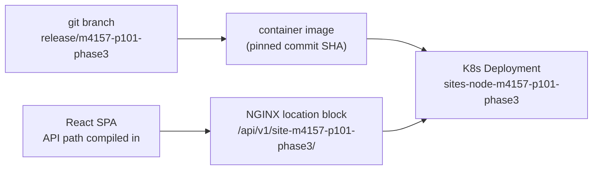
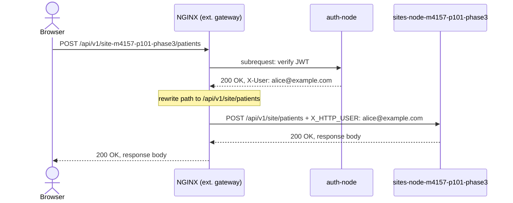
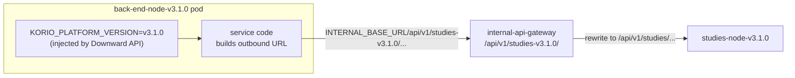
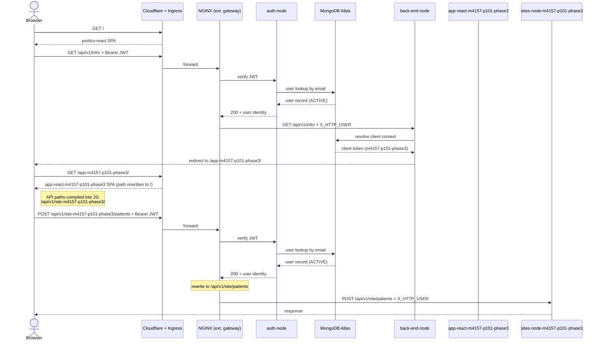
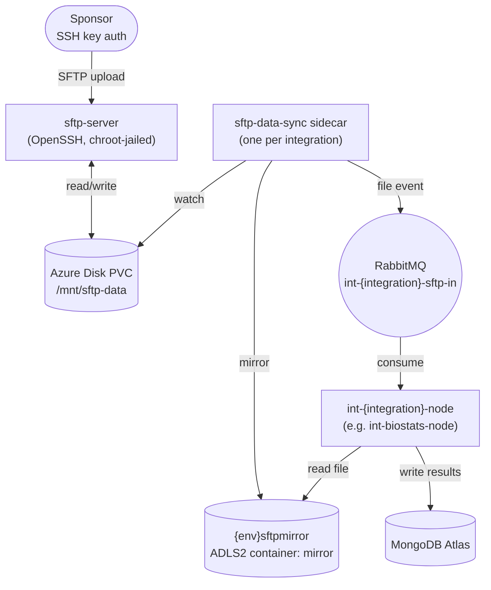
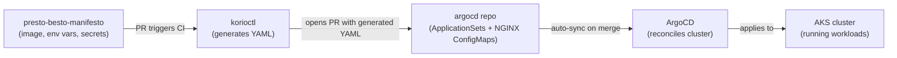

# Theory of Operation

This document explains how Korio's multi-client platform works,
building from first principles. It is intended as a conceptual primer
for engineers new to the platform. For operational detail on specific
components, see [Application Stack](application-stack.md).

---

## 1. The Business Constraint

Korio builds software for clinical trials. Before a client can use
their version of the system, they must put it through a formal
**validation and acceptance** process — a regulatory requirement that
is time-consuming and expensive. Once complete, the client requires
that no code changes be made to their accepted system. From their
perspective, any change (however small) could invalidate their
acceptance and force them to repeat the process.

This creates a tension: Korio must continue developing the platform
for new clients while guaranteeing that existing clients' accepted
versions are frozen. The naive solutions all have serious drawbacks:

| Approach | Problem |
|---|---|
| Separate cluster per client | Operationally unscalable at 50+ clients |
| Separate namespace per client | Still requires duplicating all infrastructure |
| Feature flags / config toggles | A code change is still a code change; does not satisfy the acceptance constraint |
| Separate codebase forks per client | Maintenance nightmare; no shared improvements |

Korio's solution is to run **all client versions in parallel in the
same cluster**, isolated by URL path prefix, with NGINX as the routing
layer that keeps each client connected to their pinned version.

---

## 2. The Core Insight: Path as Version Identifier

Every client's accepted version of a service is represented as a
**git branch**. That branch is built into a container image, deployed
as a separately-named Kubernetes workload, and given a dedicated URL
path prefix. NGINX binds the path prefix to the deployment.

The client version token (e.g. `m4157-p101-phase3`) appears
consistently at every layer:

| Layer | How the token appears |
|---|---|
| Git | Branch name: `release/m4157-p101-phase3` |
| Container registry | Image tag derived from a pinned commit on that branch |
| Kubernetes | Deployment and Service named `sites-node-m4157-p101-phase3` |
| URL | Path prefix: `/api/v1/site-m4157-p101-phase3/` |
| NGINX config | Location block matching that path prefix |
| React app | API path compiled into the JavaScript bundle at build time |

Because the token threads through every layer, tracing a live request
back to its git commit is straightforward.



---

## 3. Networking Foundations

### 3.1 How services find each other

In classical networked systems, a service that wants to call another
service must know the other service's IP address and port. The IP
address might come from DNS, a config file, or a service registry.
The port is typically a well-known convention.

Kubernetes automates this bookkeeping. When a service is deployed, a
**Kubernetes Service object** is created alongside it. This object:

- Assigns the deployment a **stable virtual IP (ClusterIP)** that does
  not change even if the underlying pods are restarted or rescheduled
- Registers a **DNS name** in the cluster's internal DNS resolver
  (CoreDNS): `{service-name}.{namespace}.svc.cluster.local`
- Maintains a load-balancing rule that forwards traffic from that
  virtual IP to whichever pod(s) are currently healthy

A service making a call to another service resolves the DNS name,
opens a TCP connection to the resulting IP on the target's port, and
sends an HTTP request — exactly as in classical networked systems.
Kubernetes handles the rest transparently.

Korio standardises port **8080** across all microservices, so no
service needs to carry port configuration for its peers.

The NGINX configs make the DNS resolver explicit:

```nginx
resolver 10.0.0.10 ipv6=off valid=1s;
```

`10.0.0.10` is CoreDNS. The `valid=1s` TTL instructs NGINX to
re-resolve names frequently rather than caching IPs, which matters
when pods are rescheduled.

### 3.2 The variable trick in NGINX proxy_pass

NGINX has a subtlety: if a hostname is written directly into
`proxy_pass`, NGINX resolves it once at startup and caches it
indefinitely. If the pod behind that name is rescheduled to a
different IP, NGINX will keep sending traffic to the old address.

The fix is to assign the URL to a variable first:

```nginx
# Bad: resolved once at startup, cached forever
proxy_pass http://studies-node-m4157-p101-phase3.my.svc.cluster.local:8080;

# Good: resolved on every request via the configured resolver
set $target http://studies-node-m4157-p101-phase3.my.svc.cluster.local:8080;
proxy_pass $target;
```

Using a variable forces NGINX to consult CoreDNS on every request,
honouring the `valid=1s` TTL.

### 3.3 HTTP request/response and the return path

When a browser sends a request, it opens a TCP connection to the
server and writes an HTTP request down that connection. The server
writes its response back down the same connection. The "return
address" is implicit in the TCP connection — no explicit addressing
is needed.

This matters because NGINX sits between the browser and the backend
service, splitting the journey into **two independent TCP connections**:

```
Browser <----TCP1----> NGINX <----TCP2----> sites-node
```

The browser's TCP connection terminates at NGINX. NGINX opens a
separate TCP connection to the backend. When the backend writes its
response on TCP2, NGINX reads it and writes it back on TCP1 to the
browser. Neither the browser nor the backend is aware of the other's
TCP endpoint.

This is analogous to **NAT** (Network Address Translation) at the IP
layer, where a NAT device maintains a translation table of
`(external IP:port) <-> (internal IP:port)` and rewrites packet
headers to keep both sides connected. NGINX does the same thing one
layer up: it maintains a table of in-flight HTTP request/response
pairs and stitches the two TCP connections together.

The advantage over NAT is that operating at the HTTP application layer
gives NGINX full visibility into — and the ability to modify — the
request: headers, URL path, body. A NAT device can only touch the IP
and port headers.

### 3.4 Cloudflare: WAF and authoritative DNS

All inbound web traffic passes through **Cloudflare** before reaching
Azure. Cloudflare serves two roles:

- **Authoritative DNS** — Cloudflare is the DNS authority for
  `korioclinical.com`. When a browser resolves
  `my-prod.korioclinical.com`, the answer comes from Cloudflare and
  points to Cloudflare's own edge nodes, not directly to Azure.
- **WAF (Web Application Firewall)** — Cloudflare inspects every
  inbound request against a managed ruleset (provided and maintained
  by Cloudflare — no custom rules to maintain) before forwarding it
  upstream. Common attack patterns (SQL injection, XSS, bad bots) are
  blocked here, before they ever reach the application.

Cloudflare operates as a reverse proxy in its own right: the browser's
TCP connection terminates at Cloudflare's edge, and Cloudflare opens a
separate connection to Azure. From Azure's perspective, all traffic
appears to originate from Cloudflare's IP ranges.

Because Cloudflare proxies the connection, TLS is actually terminated
twice: once at Cloudflare's edge (browser-facing), and once at the AKS
ingress (Cloudflare-facing). The certificate the browser sees is
Cloudflare's; the certificate between Cloudflare and AKS is Korio's
own wildcard certificate stored in Azure Key Vault and injected as the
`korio-tls` Kubernetes secret.

Cloudflare configuration is managed directly in the Cloudflare
dashboard, not via Terraform or any manifest in these repos. DNS
records must be updated in Cloudflare when new environments or
sub-environments are brought online.

### 3.5 AKS Web App Routing ingress (deprecated)

Inside the cluster, an **ingress controller** acts as the first
Kubernetes-native hop for inbound traffic. Korio uses the AKS **Web
App Routing** add-on (`webapprouting.kubernetes.azure.com`), which
provisions and manages an nginx-based ingress controller and its
associated Azure load balancer. This add-on is deprecated by
Microsoft; the planned replacement is **Traefik**, though the migration
has not yet been carried out.

The add-on provides two ingress classes:

| Ingress class | Load balancer | Used for |
|---|---|---|
| `webapprouting.kubernetes.azure.com` | Public (internet-facing) | All external traffic: API gateway, client React SPAs |
| `internal.webapprouting.kubernetes.azure.com` | Internal (VNet-only) | ArgoCD UI, RabbitMQ management UI, internal tooling |

For each service that needs to be reachable from outside the cluster,
a Kubernetes **Ingress** object declares the hostname, TLS secret, and
routing rule. The `api-gateway-ingress.yaml` template shows the pattern
for the API gateway:

```yaml
spec:
  tls:
  - hosts:
    - $SUB_ENVIRONMENT-$ENVIRONMENT.korioclinical.com
    secretName: korio-tls
  ingressClassName: webapprouting.kubernetes.azure.com
  rules:
    - host: $SUB_ENVIRONMENT-$ENVIRONMENT.korioclinical.com
      http:
        paths:
          - path: /api
            pathType: Prefix
            backend:
              service:
                name: api-gateway
                port:
                  name: http
```

The ingress controller terminates TLS using `korio-tls` and forwards
plain HTTP to the `api-gateway` Service (the NGINX API gateway pod) on
port 8080. From this point inward, all traffic is unencrypted — it
stays within the cluster's private VNet and never leaves Azure's
network boundary.

For client-specific React SPAs (e.g. `app-react-m4157-p101-phase3`),
the Helm chart creates an individual Ingress object per SPA with
`ingress.rewrite: true`, which strips the client-specific path prefix
(e.g. `/app-m4157-p101-phase3`) before forwarding to the container,
so the React app always receives requests at `/`.

The ingress controller and its Azure load balancer are **not** managed
by any manifest in these repos — they are provisioned by the AKS
add-on itself and bootstrapped by Terraform
(`kubectl_manifest.internal_ingress_controller`). Changes to ingress
behaviour must be made via the AKS add-on configuration, not via IaC
here.

### 3.6 The full inbound path

Putting sections 3.4 and 3.5 together, a request from a browser
traverses four distinct network hops before it reaches application
code:

```
Browser
    | HTTPS (TLS to Cloudflare cert)
    v
Cloudflare edge  (WAF inspection, DNS resolution)
    | HTTPS (TLS to korio-tls wildcard cert)
    v
AKS Web App Routing ingress  (TLS termination, Ingress routing)
    | HTTP (plain, within VNet)
    v
NGINX API gateway  (auth, path rewrite, proxy)
    | HTTP (plain, within cluster)
    v
Backend microservice pod
```

Each hop is a full TCP connection break — no single TCP connection
spans the full path from browser to service.

---

## 4. The Reverse Proxy

A **reverse proxy** is a server that sits in front of one or more
backend services, accepting requests on their behalf and forwarding
them. "Reverse" distinguishes it from a forward proxy, which sits in
front of the *client*:

```
Forward proxy: Client --> [Proxy] --> Internet
Reverse proxy: Internet --> [Proxy] --> Backend services
```

The client sends its request to the reverse proxy as if the proxy
were the destination. The proxy forwards it to the appropriate
backend. The backend never communicates directly with the client.

NGINX is used here as a reverse proxy. For each incoming request it
performs five operations in sequence:

1. **Match** — find the `location` block whose path prefix matches
   the incoming URL
2. **Authenticate** — make a subrequest to the auth service; block
   with HTTP 401 if it fails (external gateway only — see Section 5)
3. **Rewrite** — strip the client-specific path prefix, replace with
   the canonical path the backend service expects
4. **Annotate** — inject the verified user identity as `X_HTTP_USER`
   and the target service name as `X-Upstream-Service` into the
   forwarded request headers
5. **Forward** — open a TCP connection to the target Kubernetes
   Service and send the modified request

The backend receives a request that looks like it came directly from
a well-behaved caller: canonical path, known headers, no trace of
the routing layer above it.



A single NGINX config file can contain dozens of `location` blocks,
one per client/service combination. NGINX evaluates them in order and
uses the first match, so more specific prefixes must appear before
less specific ones.

---

## 5. Two Gateways: External and Internal

There are two NGINX gateway instances: one for traffic entering from
the internet (the **external gateway**), and one for traffic between
services within the cluster (the **internal gateway**).

### 5.1 External gateway

Handles all browser-originated requests. Every request passes through
an `auth_request` subrequest to the auth service before being
proxied. If the JWT is invalid or expired, NGINX returns 401 and the
request never reaches the backend.

Each location block follows this pattern:

```nginx
# +korio:korioctl:nginx:location:sites-node-m4157-p101-phase3
location /api/v1/site-m4157-p101-phase3/ {
    set $target http://sites-node-m4157-p101-phase3.my.svc.cluster.local:8080;
    rewrite ^/api/v1/site-m4157-p101-phase3/(.*)$ /api/v1/site/$1 break;
    proxy_pass $target;
    auth_request /_auth-via-auth-node;
    auth_request_set $response $upstream_http_user;
    auth_request_set $auth_status $upstream_status;
    proxy_set_header X_HTTP_USER $response;
    proxy_set_header X-Upstream-Service sites-node-m4157-p101-phase3;
    add_header X-Debug-Request-Path sites-node-m4157-p101-phase3;
}
```

### 5.2 Internal gateway

Handles service-to-service calls within the cluster. Structurally
identical to the external gateway — same location blocks, same
rewrite rules — but with all `auth_request` directives removed.
Traffic reaching the internal gateway is trusted by definition: it
originates inside the cluster and has already been authenticated at
the cluster boundary.

```nginx
# Same location, no auth
location /api/v1/studies-m4157-p101-phase3/ {
    set $target http://studies-node-m4157-p101-phase3.my.svc.cluster.local:8080;
    rewrite ^/api/v1/studies-m4157-p101-phase3/(.*)$ /api/v1/studies/$1 break;
    proxy_pass $target;
    add_header X-Debug-Request-Path studies-node-m4157-p101-phase3;
}
```

A calling service reaches the internal gateway via its
`INTERNAL_BASE_URL` environment variable. It constructs outbound URLs
using its own `KORIO_PLATFORM_VERSION` env var (see Section 7.2) to
preserve version isolation across the call chain.

### 5.3 Auth service variants

The external gateway has two auth location blocks: one backed by
`auth-node` (for legacy per-client microservices) and one backed by
`back-end-node` (for newer monolithic clients). Each client's location
block points at the appropriate auth variant. Both perform the same
logical operation: validate the JWT against Azure B2C and look up the
user in MongoDB.

---

## 6. Identity and Authentication (Azure B2C)

### 6.1 What B2C does

End users do not authenticate directly against Korio's services.
Authentication is delegated entirely to **Azure Entra B2C**, a
Microsoft-hosted Identity Provider (IdP). B2C owns:

- The login UI and credential storage
- Multi-factor authentication (email OTP)
- Token issuance — after a successful login, B2C issues an OIDC
  **ID token** (a signed JWT) and redirects the browser back to the
  application

Korio's application code never sees a user's password. It only ever
sees the JWT that B2C issues after the user has proven their identity.

### 6.2 One tenant per environment, not per client

B2C is provisioned as **one tenant per deployment environment** —
`koriodevaad`, `koriotestaad`, `koriostagingaad`, `koriob2c` (prod).
All clients within an environment share the same B2C tenant. Client
context (which version/path a user belongs to) is not encoded in the
B2C token — it is resolved post-login by `back-end-node` via a
MongoDB user lookup (see Section 8).

### 6.3 Token validation by auth-node

`portico-react` (the browser-side React app) acquires the B2C ID
token and sends it as an `Authorization: Bearer` header on every API
call. NGINX intercepts each call and issues an `auth_request`
subrequest to `auth-node` before proxying.

`auth-node` validates the token by:

1. Fetching B2C's public signing keys (JWKS) and verifying the JWT
   signature
2. Asserting the token audience matches the configured `AZURE_CLIENT_ID`
3. Looking up the user in MongoDB by the email claim (`emails[0]`)
4. Asserting the user's account is `ACTIVE`

On success, `auth-node` returns the resolved user object in a response
header. NGINX injects this as `X_HTTP_USER` on the forwarded request.
Backend services trust this header without re-validating the JWT.

### 6.4 User lifecycle management

Out-of-band user operations (create, disable, password reset, MFA
enrollment) are performed via the **Microsoft Graph API** using
service-account credentials. B2C object IDs are stored on MongoDB
user records as `user.azure_oid`. These operations are performed by
Korio administrators, not by end users.

### 6.5 Planned replacement

B2C has limitations: no headless/custom login UI, constrained SAML
federation support for sponsor SSO mandates, and a Microsoft-only
dependency. The platform intends to replace B2C with a more flexible
IdP. The key design constraints for the replacement are:

- The `auth_request` pattern and the `X_HTTP_USER` header contract
  must be preserved — NGINX config and all backend services must
  remain unchanged
- Users will be migrated **lazily** (on-demand at first login) rather
  than in a batch cutover, to avoid a hard cutover window
- Both tokens (B2C and new IdP) must be accepted in parallel during
  the migration period, per user based on their `auth_migration_status`
  field in MongoDB

See [IdP Migration](idp-migration.md) for the full requirements,
candidate provider evaluation, and lazy migration flow.

---

## 7. Version Isolation in Practice

### 7.1 Shared vs versioned services

Not every service needs a per-client deployment. Services that are
purely infrastructural (audit logging, authentication) or that have no
client-specific business logic run as a single shared instance.

The presence or absence of a client-suffixed location block in the
NGINX config is the explicit declaration of whether a service is
versioned or shared:

| Service type | NGINX location blocks | K8s deployments |
|---|---|---|
| Versioned | Canonical + one per client | One per client + one for `main` |
| Shared | Canonical only | One shared instance |

When a versioned service calls a shared service, it simply calls the
canonical path (e.g. `/api/v1/audit/`). There is no versioned
deployment to route to — the single shared instance handles all
clients.

### 7.2 Preserving version isolation across service-to-service calls

When a versioned service needs to call another versioned service, it
must construct the correct client-specific path — otherwise it would
land on the wrong version of the peer service.

The Kubernetes **Downward API** solves this by injecting a pod's own
metadata as environment variables at runtime. The Helm chart sets a
`korioPlatformVersion` label on each pod (from the ApplicationSet),
and the Downward API reads that label back into the container as
`KORIO_PLATFORM_VERSION`. The service can then construct outbound
paths like:

```
{INTERNAL_BASE_URL}/api/v1/studies-{KORIO_PLATFORM_VERSION}/...
```

This ensures that a request originating from a `v3.1.0` client always
reaches `studies-node-v3.1.0`, not some other version — without the
service needing any hardcoded knowledge of its own version token.



---

## 8. Application Data (MongoDB Atlas)

### 8.1 Role in the system

All persistent application data — user records, clinical trial data,
subject visits, study configurations — is stored in **MongoDB Atlas**,
a managed MongoDB service hosted on Azure. Atlas is the system of
record for application state; the Kubernetes cluster itself is
stateless.

Two places in the synchronous request path read from MongoDB directly:

- **`auth-node`** — on every authenticated request, looks up the user
  record by email to verify the account is active and resolve the user
  identity forwarded to backend services
- **`back-end-node`** — at login, looks up the user's client context to
  determine which client-specific app path to redirect the browser to

All other backend microservices read and write their own domains of
application data through their normal request handling.

### 8.2 Cluster and connection model

One Atlas cluster is provisioned per environment (dev, test, staging,
prod). The cluster is connected to AKS via **Azure Private Link** —
traffic between the cluster and Atlas never traverses the public
internet. One MongoDB database user is created per sub-environment
(e.g. a user named `validate`), and each sub-environment's services
connect using a `MONGO_CONNECTION_STRING` stored in Azure Key Vault.

Terraform manages the Atlas cluster, database users, and Private Link
endpoints. However, after each Terraform apply, the connection URI
(which contains the Terraform-managed password) must be **manually
written to Key Vault** — this handoff is not automated.

### 8.3 Relationship to the client version model

MongoDB is a shared, canonical service — there is no per-client Atlas
cluster or database. Client data isolation is handled at the
application layer (data records carry client identifiers), not at the
infrastructure layer. This is consistent with the general pattern: only
services with client-specific *behaviour* (i.e. versioned code) get
per-client deployments. The database holds the data for all clients in
one place; the versioned service code that interprets that data is what
gets isolated.

---

## 9. The Full Request Lifecycle

Putting all the above together, a complete request from browser to
backend involves three phases.

### Phase 1: Login and client resolution

The user arrives at `portico-react`, the common entry portal, and
authenticates via Azure B2C (Section 6). With a valid JWT,
`portico-react` calls `/api/v1/info/` (routed to `back-end-node`).
This is the **one moment** where the system asks "which client does
this user belong to?" — `back-end-node` does a MongoDB user lookup
(Section 8) and returns the client context. `portico-react` redirects
the browser to the client-specific app path (e.g.
`/app-m4157-p101-phase3/`).

### Phase 2: Client app load

The AKS ingress routes `/app-m4157-p101-phase3/` to
`app-react-m4157-p101-phase3`, rewriting the path to `/` before
delivery. The browser loads a React SPA that was built from the
accepted git commit. Crucially, the client-specific API path prefix
(`/api/v1/site-m4157-p101-phase3/`) is **compiled into the JavaScript
bundle** — it is not a runtime config value and cannot drift after
acceptance.

### Phase 3: Client API calls

Every subsequent API call from the browser carries the client-specific
path prefix. NGINX matches it, verifies the JWT via `auth_request`,
rewrites the path to canonical form, and proxies to the
client-specific backend deployment. The backend sees a normal HTTP
request with a canonical path and a trusted `X_HTTP_USER` header. It
has no knowledge of the routing layer above it.



---

## 10. Asynchronous Messaging (RabbitMQ)

### 10.1 Why not HTTP for everything

The synchronous HTTP request/response pattern works well when the
caller needs an immediate answer: authenticate this token, fetch this
record, submit this form. But some operations don't fit that model:

- The caller doesn't need a response — it just needs to notify
  something that an event occurred
- The work to be done may take longer than a reasonable HTTP timeout
- The downstream processor may not be available at the moment the
  event occurs, but must not lose the event

For these cases, Korio uses **RabbitMQ** as a message broker. The
pattern is: a producer writes a message (an event) to a named queue
and returns immediately. One or more consumers read from the queue
independently, at their own pace. RabbitMQ durably stores messages
until they are acknowledged by a consumer, so events are not lost if
a consumer is temporarily unavailable.

### 10.2 How RabbitMQ is deployed

RabbitMQ runs as a Kubernetes StatefulSet, deployed via ArgoCD as a
cluster add-on (in `argocd/addons/{env}/`) rather than as an
application service. This reflects its role as shared infrastructure
rather than a versioned business-logic service. One RabbitMQ instance
is shared across all services within an environment.

### 10.3 Primary use case: SFTP file-arrival events

The main use of RabbitMQ in the current system is the SFTP data
ingestion pipeline (Section 11). When a sponsor uploads a file via
SFTP, a sidecar container (`sftp-data-sync`) detects the new file,
mirrors it to Azure Storage, and publishes a **file-arrival event** to
a RabbitMQ queue. Downstream integration services (e.g.
`int-biostats-node`, `int-nest-node`) consume these events and
process the files asynchronously.

The queue naming convention is `int-{integration}-sftp-in` (inbound
files arriving from the sponsor) and `int-{integration}-sftp-out`
(outbound files to be delivered to the sponsor).

---

## 11. The SFTP Subsystem

### 11.1 Purpose and actors

Clinical trial sponsors periodically deliver data files to Korio
(e.g. patient enrolment data, randomisation inputs) and receive
output files in return (e.g. drug assignment reports). This data
exchange uses **SFTP** (SSH File Transfer Protocol) — an established,
auditable, firewall-friendly protocol that sponsors' systems already
know how to use.

The SFTP subsystem is entirely separate from the web request path
described in Sections 3–9. It is a distinct ingestion pipeline for
external file-based data exchange.

### 11.2 The problem with SFTP alone

SFTP is a transient file drop. Once a sponsor uploads a file, it sits
on a disk in a pod. That is insufficient for Korio's needs:

- Pod storage is ephemeral — a rescheduled pod loses its disk
- Backend services need to read the files, but the SFTP pod's disk is
  not directly accessible to them
- Files need to be durably stored and backed by Azure's storage
  redundancy guarantees

The solution is to treat the SFTP pod as an **intake point only**, and
immediately mirror every uploaded file to **Azure Data Lake Storage
Gen2 (ADLS2)** — Azure Blob Storage with a hierarchical namespace and
POSIX-style directory ACLs. ADLS2 is the durable store that both the
SFTP subsystem and all downstream services read from and write to.

### 11.3 Runtime data flow

```
Sponsor
    | SSH key auth, port 22
    v
sftp-server pod (AKS)
    | writes file to Azure Disk (shared PVC)
    v
sftp-data-sync sidecar (one per integration)
    | mirrors file to {env}sftpmirror/mirror/{env}/{subenv}/{sponsor}/{integration}/...
    | publishes file-arrival event to RabbitMQ queue: int-{integration}-sftp-in
    v
RabbitMQ
    v
int-{integration}-node (e.g. int-biostats-node, int-nest-node)
    | reads file from ADLS2
    | processes data, writes output to MongoDB or ADLS2
```



### 11.4 Identity: how pods authenticate to Azure Storage

Pod-to-Azure-Storage authentication uses **Azure Workload Identity**,
which avoids embedding any secrets in the cluster. The mechanism has
three components:

- **UAMI (User Assigned Managed Identity)** — A named Azure identity
  representing a pod workload. Azure RBAC roles (e.g. Storage Blob
  Data Contributor) are granted to the UAMI.
- **FIC (Federated Identity Credential)** — The trust binding between
  a Kubernetes ServiceAccount and the UAMI. It tells Azure AD: "trust
  tokens issued by this cluster for this ServiceAccount as if they were
  this UAMI." Azure AD exchanges the pod's ServiceAccount token for an
  Azure access token at runtime. No passwords or keys are stored in
  the cluster.
- **DLDP (Data Lake Directory Path)** — The ADLS2 directory tree must
  be pre-created with POSIX ACLs granting the right UAMIs the right
  permissions before any files can be written. `korioctl azure dldp
  create` creates the directory and sets its ACLs in one step.

Two UAMIs are involved per integration: one for the `sftp-server` pod
(Terraform-managed), and one for each downstream integration service
(manually provisioned via `korioctl`). Each has its own FIC binding to
its respective Kubernetes ServiceAccount.

### 11.5 Pod structure

The SFTP deployment is a single Kubernetes pod containing multiple
containers that coordinate via a shared volume:

| Container | Type | Role |
|---|---|---|
| `ssh-keys-init` | Init | Sets correct permissions on SSH host keys from ConfigMap before server starts |
| `sftp-acl-init` (one per integration) | Init | Creates the SFTP directory tree and applies POSIX ACLs on the shared PVC before server starts |
| `sftp-server` | Main | OpenSSH daemon; accepts sponsor connections; chroot-jails each user to their home directory |
| `sftp-data-sync` (one per integration) | Sidecar | Watches directories on the PVC; mirrors new files to ADLS2; publishes RabbitMQ events |

The init containers run to completion before the main container
starts, ensuring the directory structure and ACLs are correct before
the SFTP server accepts any connections.

---

## 12. Keeping the Configs Consistent

The NGINX ConfigMaps (`api-gateway-cm.yaml`,
`internal-api-gateway-cm.yaml`) exist for every combination of
environment (dev, test, staging, prod, ...) and sub-environment
(configure, preview, validate, accept, my). Editing them by hand would
be error-prone — a misconfigured location block could silently route a
client to the wrong version of a service.

The toolchain that prevents this:

- **presto-besto-manifesto** — the human-facing interface. Developers
  declare three things per service: container image, env vars, secrets.
  Everything else is derived.
- **korioctl** — a Go CLI that reads the presto manifests and generates
  the NGINX ConfigMaps and ArgoCD ApplicationSet YAMLs. The
  `# +korio:korioctl:nginx:location:...` comments in the ConfigMaps
  are machine-readable markers korioctl uses to identify, diff, and
  regenerate individual blocks without touching the rest of the file.
- **ArgoCD** — watches the git repos containing the generated YAMLs.
  With `selfHeal: true`, it continuously reconciles the cluster to
  match what is committed. No manual `kubectl apply` can create lasting
  drift.



The NGINX config is a Kubernetes ConfigMap committed to git, so the
full history of routing changes is auditable and every change goes
through a PR review before taking effect.

---

## Further Reading

- [Application Stack](application-stack.md) — detailed reference for
  each component: NGINX location block anatomy, korioctl commands,
  Helm chart architecture, ArgoCD ApplicationSet structure, CI
  workflows, Azure B2C integration
- [Infrastructure](infrastructure.md) — Terraform, AKS cluster
  bootstrap, external dependencies (Cloudflare, MongoDB Atlas,
  Twingate), MongoDB Atlas credential management
- [SFTP](sftp.md) — SFTP subsystem detail: Kustomize structure, UAMI
  provisioning, adding new integrations, CI workflows
- [IdP Migration](idp-migration.md) — B2C replacement requirements,
  candidate providers, lazy migration flow
- [Observability](observability.md) — The platform runs a dual
  observability stack during an in-progress migration: **Azure Monitor**
  (managed Prometheus metrics, Container Insights, Log Analytics) is the
  legacy stack; **Datadog** is the target (APM, log aggregation,
  dashboards). Both are partially active at the same time. Grafana
  provides dashboards over both data sources; PagerDuty handles on-call
  alerting. If monitoring tooling appears inconsistent or duplicated,
  this migration is why. See `observability.md` for the full stack
  detail and migration status.
